# 노원상 | 6년 차 모바일 풀스택 개발자

안녕하세요. **React Native, Android, iOS, Spring 기반 서버 개발 경험을 두루 갖춘 모바일 풀스택 개발자 노원상**입니다.

저는 맡은 일에 끝까지 책임을 다하며, 현실에 안주하지 않고 **지속적인 성장과 개선**을 중요하게 여깁니다.  
더존비즈온 재직 중에는 회사 내 최초로 **크로스 플랫폼 도입을 성공**하였고, React Native 사내 테크톡을 통해 상태관리 아키텍처 등 기술 교육을 전사적으로 주도했습니다.

이후 동화기업에 재직하여 **10개 이상의 앱을 단독 유지보수 및 운영**하면서 모바일 전반의 기술 의사결정과 커뮤니케이션을 주도하고 있습니다.

**앱 개발뿐만 아니라 서버, 인프라, 배포, 인증, 보안까지 아우르는 폭넓은 실무 경험**을 바탕으로  
저는 일반적인 모바일 개발자보다 더 깊고 넓은 시야로 기술을 바라보며 일할 수 있다고 자부합니다.

<br>

## 경력 (총 경력 : 5년 11개월)

### 🔹 동화기업(주) | 2022.07.06 ~ 재직중

[동화기업 회사정보 확인](https://www.dongwha.com/main/main.asp)

- **하이브리드 앱 5종 단독 유지보수 및 기능 개선**
  - GreenNet, D-RMS, D-Sales, D-Partners, IT-Service<br>
- **하이브리드 웹앱 3종 단독 유지보수**
  - D-Logis, Smart-Factory, D-RMS VN
- **신규 앱 개발**
  - VRGDW Store (베트남 고객용 주문관리 앱)
  - VRGDW D-Sales (베트남 자재 영업관리 앱)<br>
- **10개 이상의 Android/iOS 하이브리드 앱 단독 운영 및 스토어 배포**<br>
- **Spring + MySQL 기반 API 및 AWS 서버/인프라 운영**<br>
- **JWT, OAuth 2.0 기반 보안 인증 설계 및 적용**<br>
- **모바일 클라이언트와 백엔드를 포함한 풀사이클 개발 경험**<br>
- **Web <-> Native Bridge & Native Module 설계 및 적용**<br>

### 🔹 (주) 더존비즈온 | 2019.07.15 ~ 2022.01.13

[(주)더존비즈온 회사정보 확인](https://www.jobplanet.co.kr/companies/81407/landing/%EB%8D%94%EC%A1%B4%EB%B9%84%EC%A6%88%EC%98%A8)

- **React Native 기반 신규 앱 4개 개발**
  - Nahago (임금명세서, 출퇴근관리, 연말정산 기능 -> 직원관리 모바일 앱)
  - NAYANA → 우리도 (강원도청 모바일 앱)
  - WehagoOne (블록체인 간편계약 모바일 앱)
  - WehagoSign (전자서명 인증 서비스 모바일 앱)<br>
- **Android 앱 유지보수 및 기능 개선**
  - Wehago (B2B 협업 플랫폼)<br>
- **보안 기술 경험**
  - Sign-Then-Encrypt (RSA + AES + Signature)<br>
- **회사 내 최초 React Native 프로젝트 도입 및 아키텍처 설계 주도(+ 사내 전체 교육)**<br>
- **전자서명 모바일 인증서 구현 경험 (모바일 Sign-Then-Encrypt 보안 흐름을 설계 및 구현)**<br>
- **정부 과제 프로젝트 성공경험 -> 정부 지원금 지급 및 성과 인정**<br>
- **JIRA, GitLab, Wiki 기반의 협업 환경 운영**<br>

### 🔹 인턴 활동

- **(주) 제튼** (2019.02 ~ 2019.06)  
  [(주) 제튼 회사정보](<https://www.saramin.co.kr/zf_user/company-info/view/csn/VUVwS0RuV0hsTDJGUnBmWG5WaVkxdz09/company_nm/(%EC%A3%BC)%EC%A0%9C%ED%8A%BC>)
- **(주) 클루소프트** (2018.06 ~ 2018.08)  
  [(주) 클루소프트 회사정보](<https://www.saramin.co.kr/zf_user/company-info/view/csn/bDd0Rmx6UWM3d0VjTENDYlhtLzIvZz09/company_nm/(%EC%A3%BC)%ED%81%B4%EB%A3%A8%EC%86%8C%ED%94%84%ED%8A%B8>)

---

<br>

# 🛠️ 보유 기술 스택

**Mobile & Cross-Platform**  


**Frontend & UI**  


**Backend & Database**  


**Cloud & DevOps**  


**Security & Tools**  


## 🛠️ 기술 스택 및 상세 경험

| 기술 영역            | 주요 경험 및 성과                                                                                                                                                                                                                              |
| -------------------- | ---------------------------------------------------------------------------------------------------------------------------------------------------------------------------------------------------------------------------------------------- |
| **React Native**     | - 4개 신규 앱 개발 (더존비즈온)<br>- Redux Toolkit, React Query 기반 상태 관리<br>- Clean Architecture 적용 및 TypeScript 도입<br>- 회사 최초 React Native 도입 및 사내 교육 주도                                                              |
| **Java & Spring**    | - Spring Boot 3.x 기반 엔터프라이즈 API 서버 구축<br>- JWT, OAuth 2.0 통합 인증 시스템 설계<br>- JPA/Hibernate 기반 데이터베이스 설계<br>- 10개+ 모바일 앱 백엔드 단독 운영                                                                    |
| **Vue 3 & Frontend** | - Nuxt 3 + TypeScript 기반 관리자 시스템 구축<br>- Composition API + Pinia 상태 관리<br>- Tailwind CSS 반응형 UI 구현<br>- 실시간 모니터링 대시보드 개발 (Highcharts 연동)                                                                     |
| **AWS & DevOps**     | - EC2, RDS(Aurora MySQL), ElastiCache 운영<br>- CodeBuild/CodeDeploy CI/CD 파이프라인 구축<br>- ALB, CloudFront, S3 인프라 설계<br>- 무중단 배포 및 모니터링 체계 구축                                                                         |
| **Mobile Native**    | - Android(Kotlin/Java) + iOS(Swift/Objective-C) 네이티브 모듈 개발<br>- 카메라, 보안저장소, Push 등 커스텀 모듈 구현<br>- FCM v1, APNs 기반 Push 시스템 구축<br>- 기업용 배포 및 App Store 심사 대응                                           |
| **Hybrid App**       | - Morpheus 기반 10개+ 하이브리드 앱 단독 유지보수 및 운영<br>- JavaScript-Native Bridge 설계 및 구현<br>- Google Play, App Store 배포 및 OS 정책 변경 대응<br>- SDK 업그레이드 및 보안 정책 총괄 관리<br>- WebView 커스터마이징 및 성능 최적화 |

---

<br><br>

# 협업 도구 및 운영 도구 (관리)

- Company Manament

```sh
- GitHub, GitLab, SourceTree, CodeCommit 등 다양한 협업 플랫폼 활용
- JIRA, Confluence(Wiki)를 활용한 일정 및 문서 관리
- EsLint, Prettier를 통한 코드 품질 및 일관성 유지
- App Store, Google Play Console을 통한 모바일 앱 스토어 배포 경험
- AWS (EC2, RDS), Whatap 등을 활용한 인프라 운영 및 모니터링 경험
- 다양한 프로젝트에서 아키텍처 설계 및 기술 도입 주도
   → 회사 내 최초 React Native 하이브리드 프로젝트 도입 및 팀 내 기술 전파
```

- People Management

```sh
  교육: 회사 테크톡발표 , React-Native 교육 , redux 아키텍쳐 교육, Native kotlin 교육 제공
```

<div>
<a href="https://github.com/nowonsang/portfolio/blob/main/images/education/education1_file.pdf">
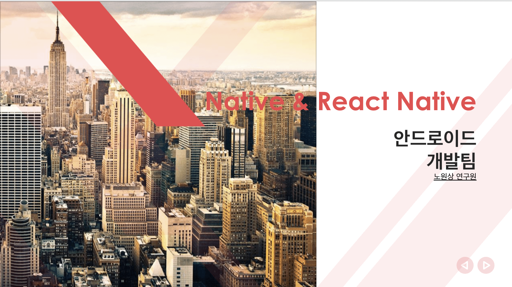
</a>
<a href="https://github.com/nowonsang/portfolio/blob/main/images/education/education2_file.pdf">
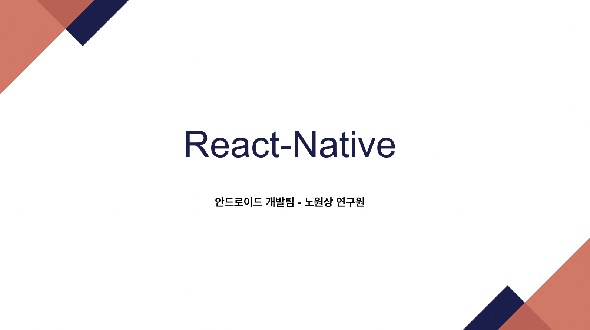
</a>
<a href="https://github.com/nowonsang/portfolio/blob/main/images/education/education3_file.pdf">
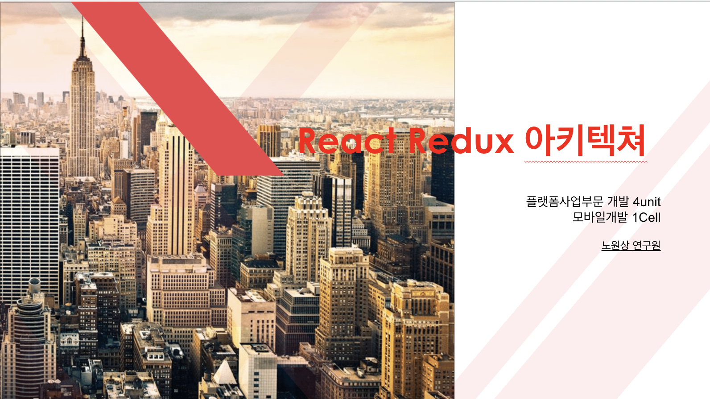
</a>
</div>

## <br>

# 🚀 엔터프라이즈 모바일 플랫폼 자체 구축 프로젝트

## 국내 1위 상용 솔루션(Morpheus) 완전 대체 → 단 2명으로 5개월 만에 달성

| 구분                | 내용                                                                                                                |
| ------------------- | ------------------------------------------------------------------------------------------------------------------- |
| **회사**            | 동화기업(주)                                                                                                        |
| **기간**            | 2025.07.05 ~ 2025.12.31 **(5개월)**                                                                                 |
| **팀 구성**         | **핵심 개발 2인** (Technical Lead)                                                                                  |
| **담당 역할**       | **기획 · 아키텍처 설계 · 풀스택 개발 · UI/UX 디자인 · AWS 인프라 · CI/CD · 배포 · 운영** 총괄                       |
| **핵심 성과**       | **외부 기술 종속성 0% 달성**                                                                                        |
| **비즈니스 임팩트** | 국내 모바일 플랫폼 **1위 기업 유라클 Morpheus 솔루션**을 **React Native + Expo** 기반 **자체 플랫폼으로 100% 대체** |

### 🔍 프로젝트 개요 & 핵심 가치

> **"불가능을 가능으로 만든 기술 내재화 혁신 프로젝트"**
>
> **수십 명의 인력과 수년의 시간을 투입해야 할 프로젝트를 단 2명이 5개월 만에 완성**

**🎯 프로젝트 배경**

- 국내 모바일 플랫폼 **점유율 1위 유라클 Morpheus** 솔루션에 **100% 의존**하던 구조
- **연간 수천만원의 라이선스 비용** + **기술 종속성으로 인한 확장성 제약**
- 급변하는 모바일 생태계에 **빠른 대응 불가능**한 상황

**💪 혁신적 해결**

- React Native & Expo 기반 **완전 자체 기술 스택**으로 100% 전환
- **기획 → 설계 → 개발 → 배포 → 운영** 전 과정을 **Technical Lead**로 주도
- **엔터프라이즈급 모바일 생태계**를 **최소 인력으로 최대 효과** 달성

#### 🎯 **핵심 구축 시스템**

- **🖥️ 모바일 관리자 플랫폼**: API/APIKey 관리, Push 시스템, **OTA 무선 배포**, 리소스 관리, 디바이스 관리, 버전 관리, 앱스토어 연동, **실시간 모니터링 대시보드**
- **📱 Push 서버 자체 구축**: Spring Boot + **FCM v1 API** 기반 Silent/Public Push, **대용량 사용자 관리**, **실시간 전송 상태 추적**
- **⚡ 크로스플랫폼 환경**: Morpheus 종속 **JS 하이브리드 → React Native + Expo** 완전 전환, **Clean Architecture** 적용

#### 💡 **기술적 도전과 해결**

- **Legacy Migration**: 기존 Morpheus 종속 코드베이스를 React Native 아키텍처로 완전 재설계
- **Performance Optimization**: 네이티브 수준의 성능을 위한 Clean Architecture 적용
- **DevOps 자동화**: AWS 기반 CI/CD 파이프라인 구축으로 배포 자동화 달성

### ⚙️ 기술 스택 (Technical Lead)

- **Mobile (Cross-Platform)**: React Native, Expo (Prebuild), TypeScript, WebView
- **Android**: Kotlin , WebView , Firebase
- **iOS** : Swift , WKWebView , APNs
- **Frontend (Admin)** : Vue 3, Nuxt 3, TypeScript, Tailwind CSS, Pinia, Highcharts
- **Backend** : Java 21, Spring Boot 3.x, JPA/Hibernate, MySQL, SQLite
- **DevOps & Infra** : AWS (Amplify, ALB, S3), CI/CD (CodeBuild/Deploy), Gradle
- **Security & Auth** : Spring Security, M365 OAuth 2.0, JWT, Proguard
- **Push & Monitoring** : FCM v1, APNs, Firebase Analytics, WhaTap
- **AI & Tools** : Cursor AI, ,uxPilot , Claude, Figma Mcp, Playwright , shrimp-task-manager ,NapKin, FileMcp

### 🚀 주요 성과 & 비즈니스 임팩트 (Key Achievements)

#### 📊 **전략적 성과**

```sh
🔧 외부 기술 종속성 0% 달성 (완전 자체 기술 스택)
👥 최소 인력으로 최대 효과 (2인 → 엔터프라이즈급 플랫폼 구축)
```

#### 🎯 **기술적 성과**

```sh
🏗️  엔터프라이즈 모바일 플랫폼 풀스택 아키텍처 설계 & 구현 (Vue3 + Spring Boot + React Native)
📱  크로스플랫폼 네이티브 앱 개발 환경 구축 (React Native + Expo + Clean Architecture)
🔔  실시간 Push 시스템 자체 개발 (Spring Boot + FCM v1 API + 사용자 관리)
☁️  AWS 클라우드 인프라 설계 & CI/CD 파이프라인 구축 (CodeBuild + CodeDeploy + ALB)
🎨  기획 · UX/UI 디자인 · 개발 · 운영 전 과정 Technical Leadership
```

#### 🏆 **리더십 & 임팩트**

- **Technical Lead**: 단 2명의 개발 인력으로 기술 방향성 결정 및 아키텍처 설계 주도
- **Full-Cycle Ownership**: 기획 → 설계 → 개발 → 배포 → 운영까지 전 과정 책임
- **Legacy Modernization**: 레거시 시스템을 최신 기술 스택으로 성공적 전환
- **Cost Optimization**: 외부 솔루션 의존도 제거를 통한 TCO 대폭 절감

<br>

<div>
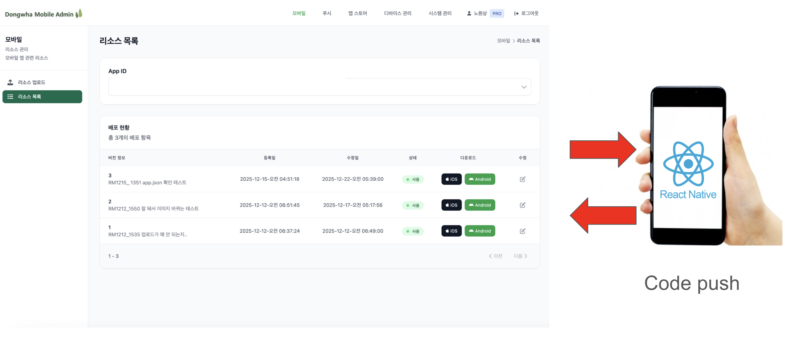
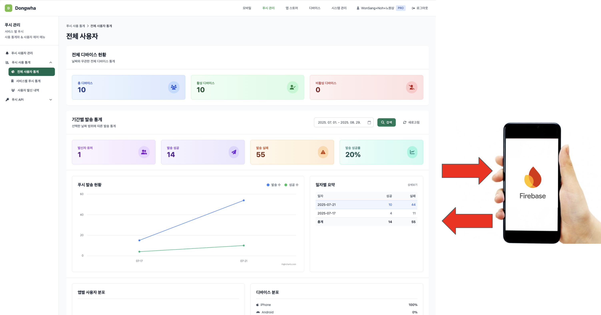
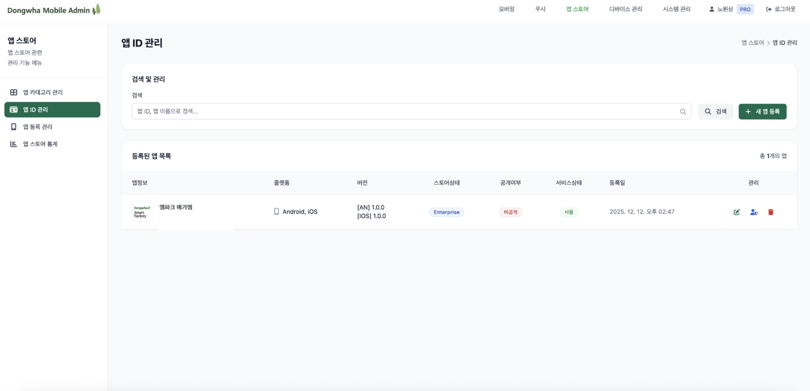
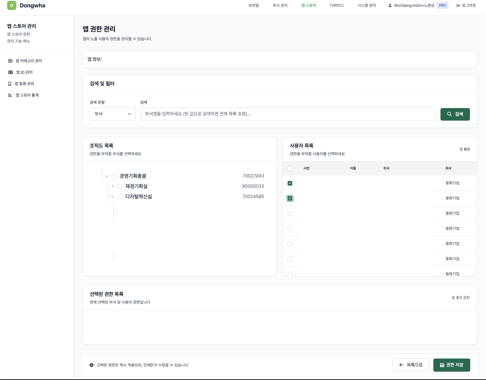
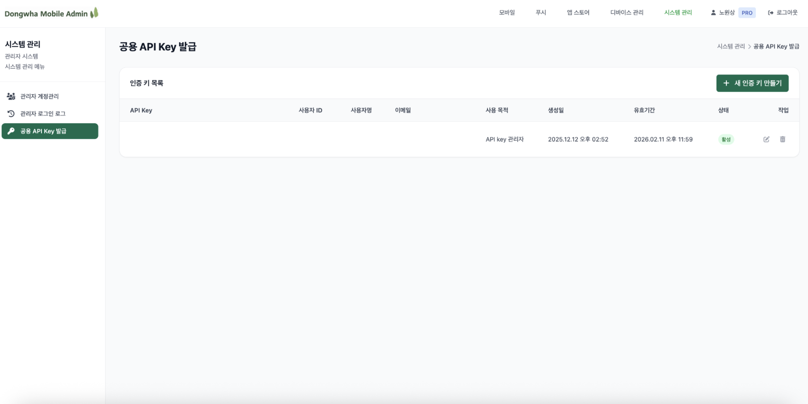
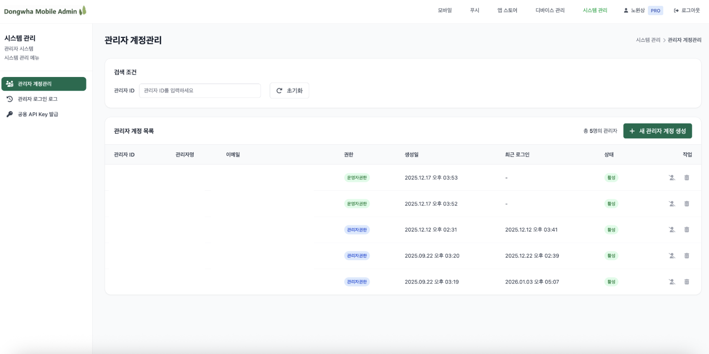
</div>

## <br>

# hybrid 프로젝트

## 하이브리드 앱 (GreenNet, D-RMS, D-Sales, D-Partners, it-Service) 유지보수/고도화

**앱명**: GreenNet, D-RMS, D-Sales, D-Partners, IT-Service (총 5개의 모바일앱)  
**회사**: 동화기업㈜  
**기간**: 2022.07.06 ~ 현재  
**운영 인원**: 1인 단독 운영  
**담당 역할**: Android/iOS 하이브리드 앱 유지보수 및 서버·인프라 운영<br>
**핵심 성과**: 5개 앱 무중단 단독 유지보수 (Android/ IOS)

### 🔍 프로젝트 소개

- GreenNet 모바일 : 결재, 직원 관리, 조직 문화, 사내 전반에서 발생하는 다양한 행위와 사내 업무지원 모바일 앱
- D-RMS : 사내 원재료의 입고/출고 관리 모바일 앱
- D-Sales : 영업사에 필요한 보드 & 건장재 자재 주문, 출고, 시공, A/S, 배송 시스템 모바일앱
- D-Partners : 파트너사 보드 & 건장재 자재 주문, 출고, 시공, A/S, 배송 시스템 모바일앱
- it-Servies : 사내 it 서비스 시스템상에 이슈 & 개선 요청 관리 모바일 앱

### ⚙️ 기술 스택 (Technical Lead)

- **Android**: Java, RxJava, WebView
- **iOS**: Objective-C, WKWebView
- **Hybrid**: Morpheus, JavaScript, jQuery, CSS
- **Backend**: Spring, RESTful API
- **DB**: MySQL, SQLite
- **Architecture**: Clean Architecture
- **Security**: Proguard, OAuth 2.0, JWT
- **Push & Dependency**: Firebase, APNs
- **Debugging**: Chrome DevTools, Safari Web Inspector, Remote Log
- **CI/CD**: CodeCommit, CodeBuild, CodeDeploy, AWS Pipeline
- **Certificate Management**: Signing, Provisioning, Key 관리
- **Monitoring**: Whatap, Google Analytics
- **AI Utilization**: Cursor AI, uxPliot, anima

### 🚀 주요 성과 (Key Achievements)

```sh
모바일 통합 로그인 체계 (AD -> M365 oAuth 2.0) 구축 (모바일 클라이언트와 백엔드를 포함한 풀사이클 개발)
전자결재 푸시 뱃지 동기화 ( IOS / Android )
스마트렌즈 & 재고조회 등 신규 서비스 (10종 이상 개발)
이미지 로딩 성능 개선
약 100건 이상 기능 개선
```

<br>

<div>
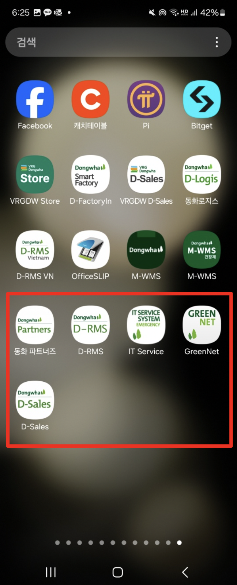
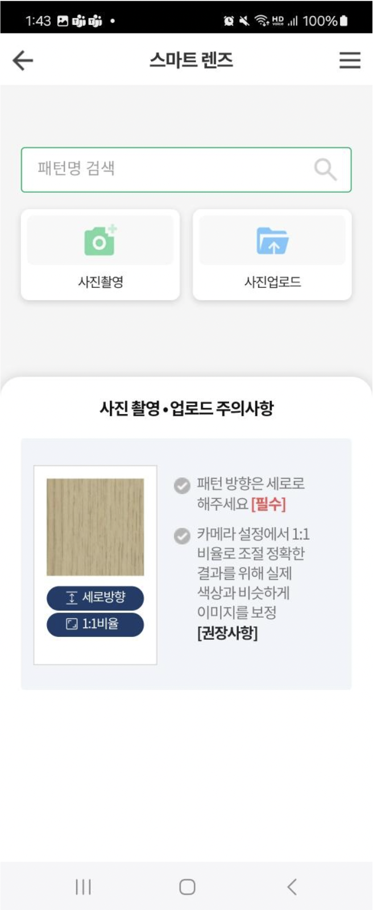
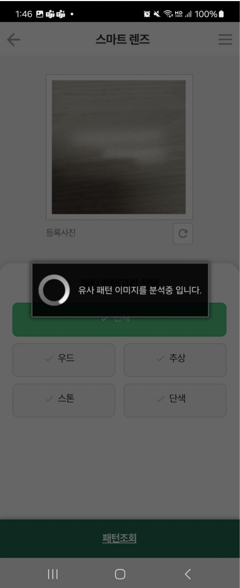
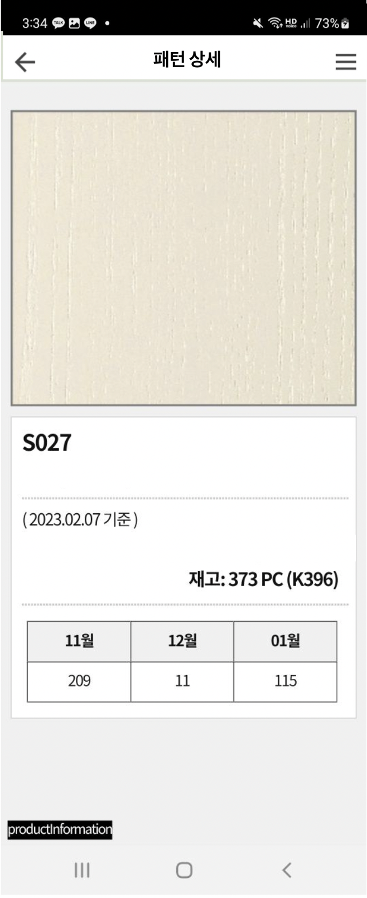
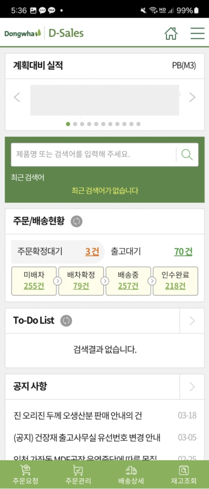
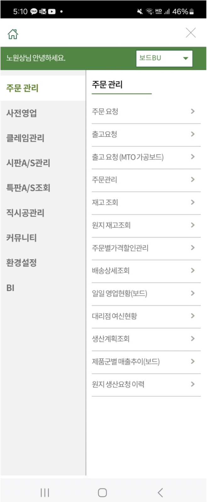
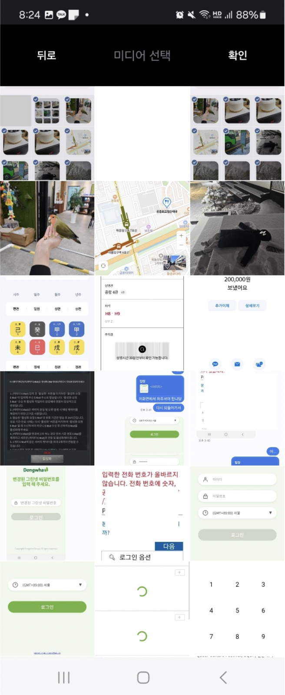
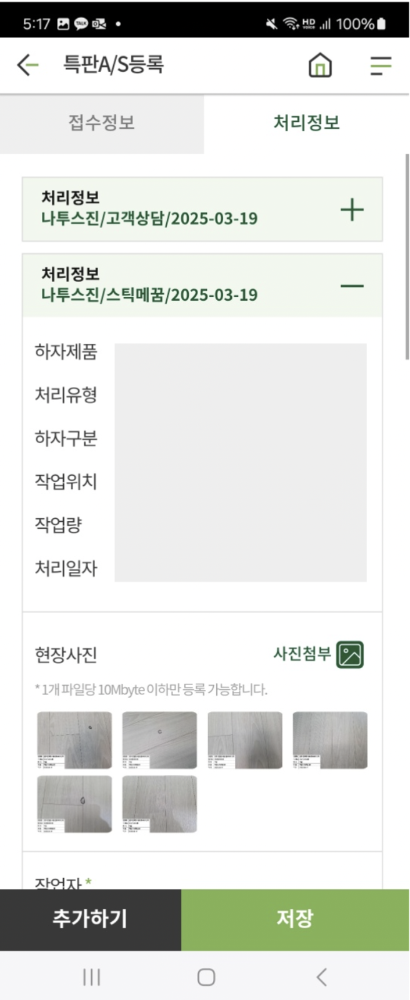
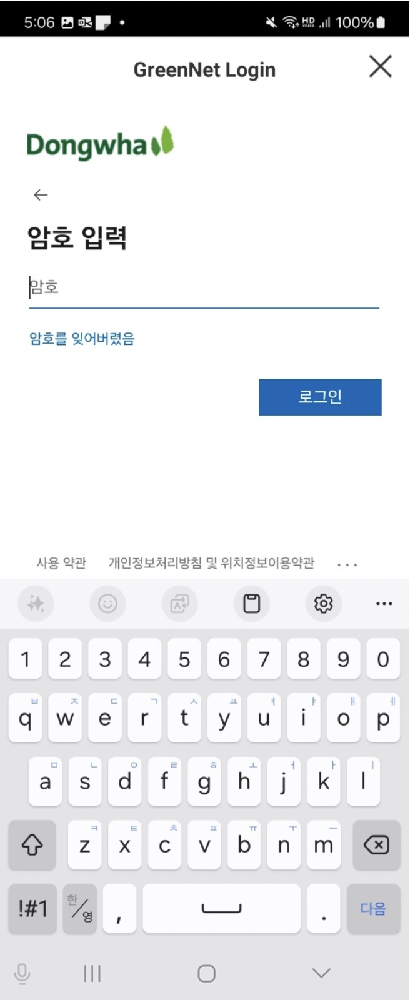
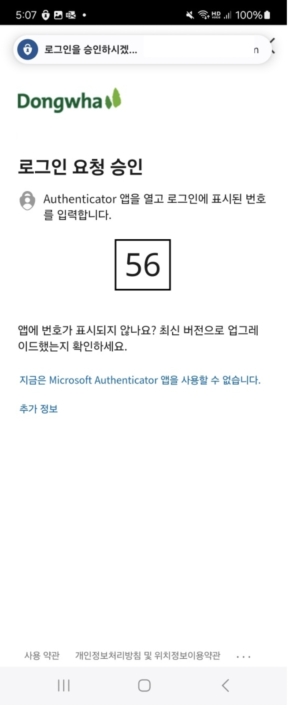
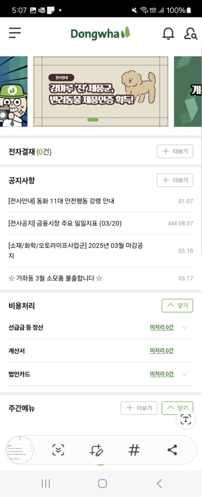
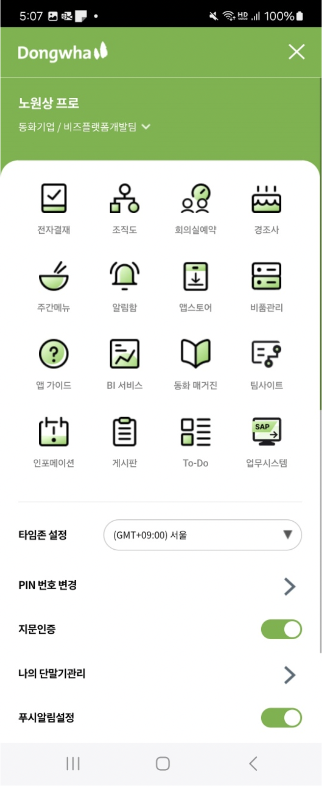
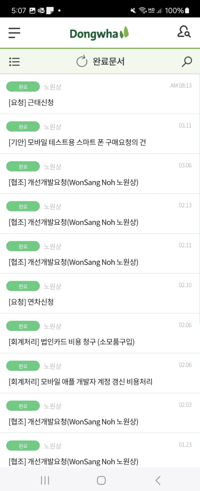
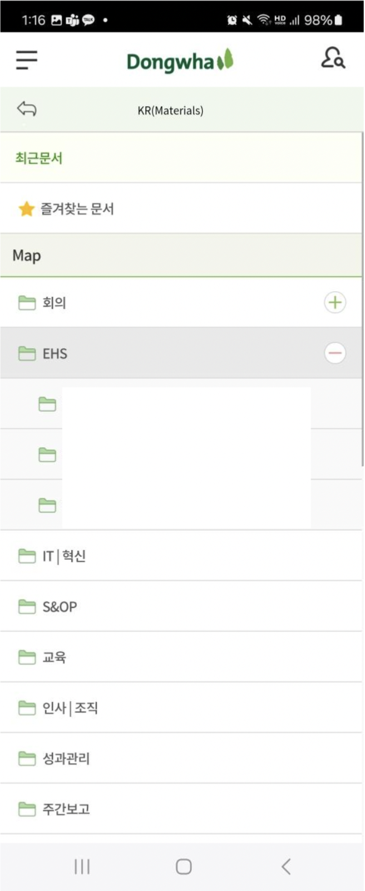
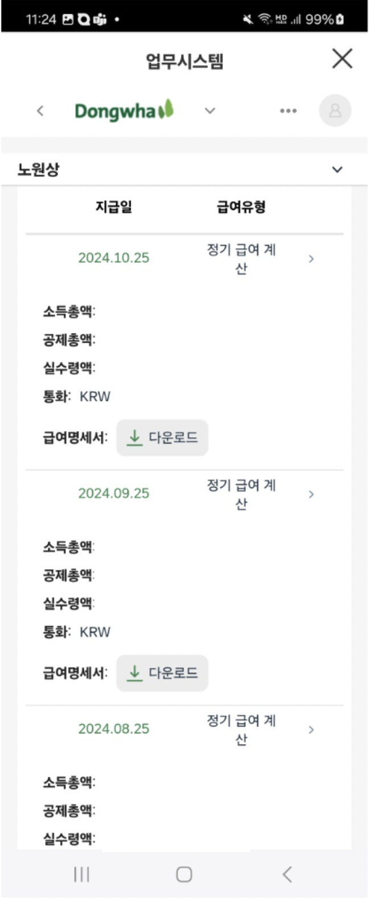
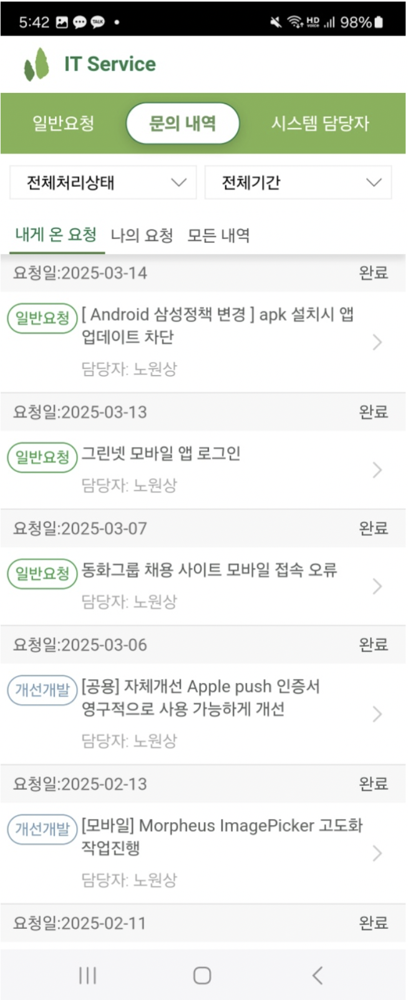
</div>

<br>

## 하이브리드 웹앱 (D-Logis, Smart-Factory, D-RMS VN) 유지보수/고도화

**앱명**: D-Logis , Smart-Factory , D-RMS VN (총 3개의 모바일앱)<br>
**회사**: 동화기업㈜  
**기간**: 2022.07.06 ~ 현재  
**운영 인원**: 1인 단독 운영  
**담당 역할**: Android / iOS 하이브리드 웹앱 단독 운영, webView 브릿지 유지보수<br>
**핵심 성과**: 3개 앱 무중단 단독 유지보수 (Android/ IOS)

### 🔍 프로젝트 소개

- D-Logis : 사내 배송기사 , 운송장 관리 모바일 웹앱
- Smart-Factory: 공장 현황과 제품 오더 스케줄을 데이터와 연계하며 관리하는 모바일 앱
- D-RMS VN : 베트남 지역의 원재료를 효율적으로 관리하고 업무를 처리할 수 있도록 돕는 모바일 앱

### ⚙️ 기술 스택 (Technical Lead)

- **Android**: Java, WebView
- **iOS**: Objective-C, WKWebView
- **Hybrid**: Morpheus, JavaScript, jQuery, CSS
- **Native Module**: Android/iOS JS Bridge
- **WebView Control**: Window, File Download, Console Redirect
- **Debugging**: Chrome DevTools, Safari Web Inspector, Remote Log
- **Dependency Management**: Firebase, APNs
- **CI/CD**: CodeCommit, CodeBuild, CodeDeploy, AWS Pipeline
- **Certificate Management**: Signing, Provisioning, Key
- **Monitoring**: Whatap, Google Analytics
- **AI Utilization**: GPT-4, Cursor AI

### 🚀 주요 성과 (Key Achievements)

```sh
WebView 커스터마이징을 통한 사용자 경험 개선 (URL 스킴 감지, 팝업 처리, 파일 다운로드 등 WebView 내부 기능을 커스터마이징)
JS ↔ Native 연동 구조 직접 구현 (브릿지 모듈을 직접 설계 및 개발 )
서브앱 로그인 연동 기능 신규 구현 (URL Scheme , AD -> OAuth)
약 15건 이상의 기능 개선
```

<br>

<div>
  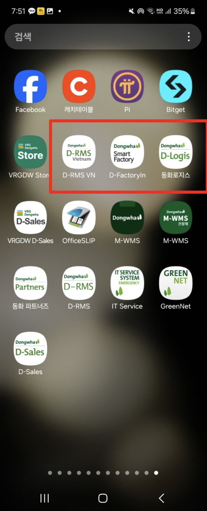
  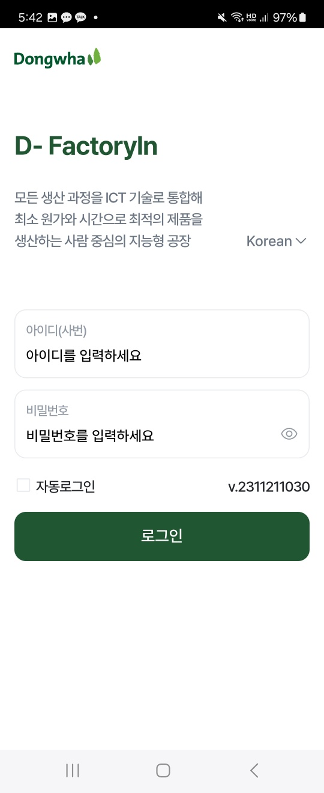
  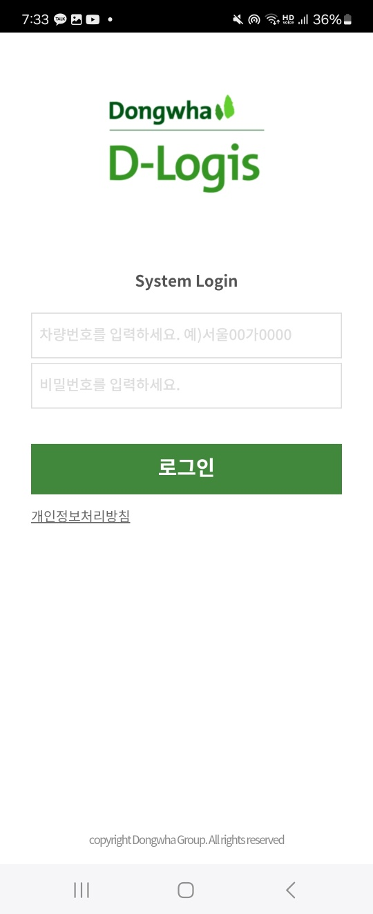
  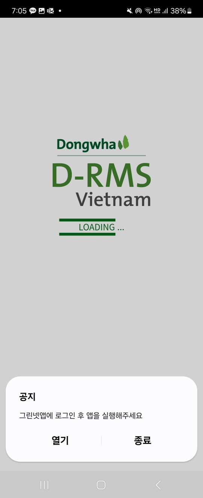
  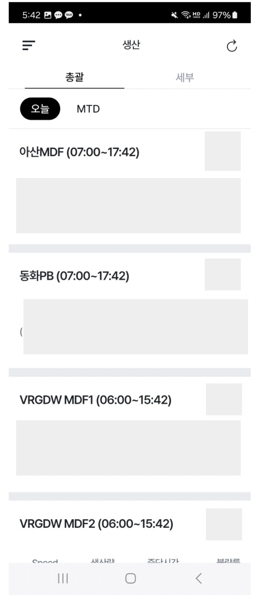
  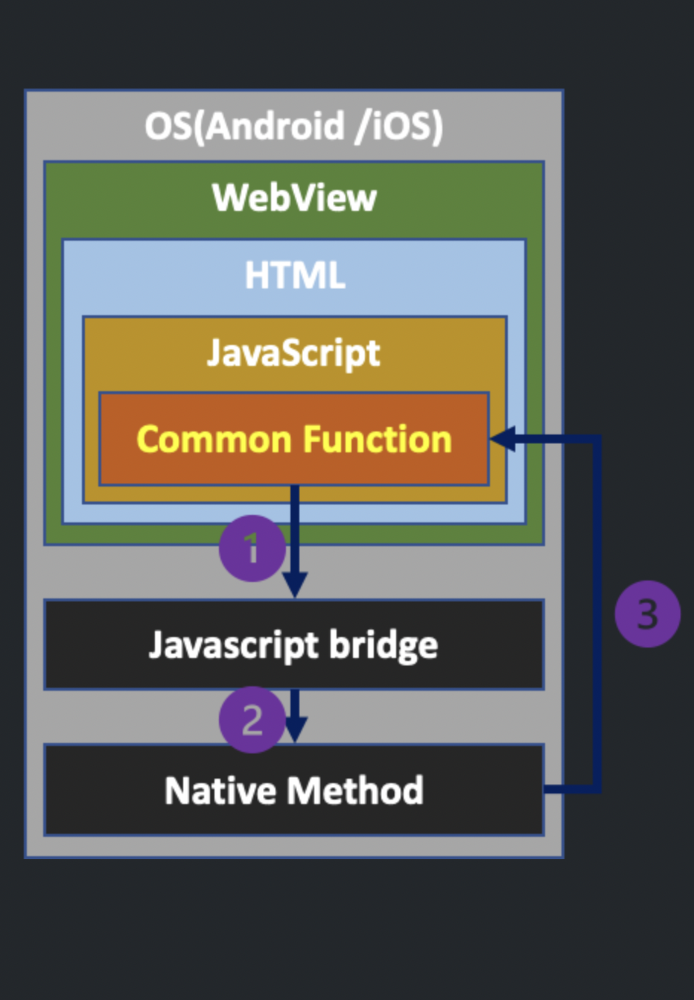
</div>

## VRGDW Store (베트남 고객용 주문관리 모바일 앱)

**앱명**: VRGDW Store<br>
**회사**: 동화기업㈜<br>
**기간**: 2023.11.20 ~ 2024.01.25 (약 2개월)<br>
**참여 인원**: 1인 단독 개발<br>
**담당 역할**: WebView 기반 앱 전면 개발부터 배포까지 단독 수행<br>
**핵심 성과**: JS-Native 연동 구조를 안정적으로 구축하여 앱-웹 간 통신 효율성 확보
안정적인 서비스 오픈과 ,서비스 초기 안정성 확보 및 사용자 피드백 대응 완료<br>

### 🔍 프로젝트 소개

- 베트남 고객이 모바일로 자재를 주문, 주문 현황과 보고서를 확인할 수 있는 비즈니스 전용 모바일 앱

### ⚙️ 기술 스택 (Technical Lead)

- **Android**: Java, WebView
- **iOS**: Objective-C, WKWebView
- **Hybrid**: Morpheus, JavaScript, jQuery, CSS
- **Native Module**: Android/iOS JS Bridge 구현
- **WebView Control**: Window, File Download, Console Redirect
- **Debugging**: Chrome DevTools, Safari Web Inspector, Remote Log
- **Security**: Proguard
- **Dependency Management**: Firebase, APNs
- **CI/CD**: CodeCommit, CodeBuild, CodeDeploy, AWS Pipeline
- **Certificate Management**: Signing, Provisioning, Key 관리
- **Monitoring**: Whatap, Google Analytics
- **AI Utilization**: GPT-4, Cursor AI

### 🚀 주요 성과 (Key Achievements)

```sh
WebView 기반 글로벌 하이브리드 앱 단독 개발 및 배포 (설계 및 개발, 테스트, 스토어 배포까지 전 과정을 1인 단독 수행)
WebView 커스터마이징을 통한 사용자 경험 개선 (URL 스킴 감지, 팝업 처리, 파일 다운로드 등등)
JS-Native Bridge 및 커스텀 Native 모듈 설계/구현 (다양한 하이브리드 연동 기능을 커스터마이징하여 완성)
보안 저장소를 활용한 사용자 민감 정보 보호 (Android Keystore, iOS Keychain)
Mobile Push 신규 연동 (Android , ios)
GooglePlay ,AppStore 배포
```

<br>

<div>
  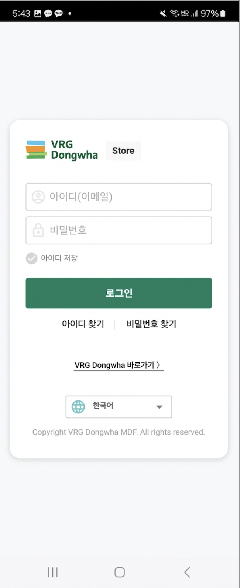
  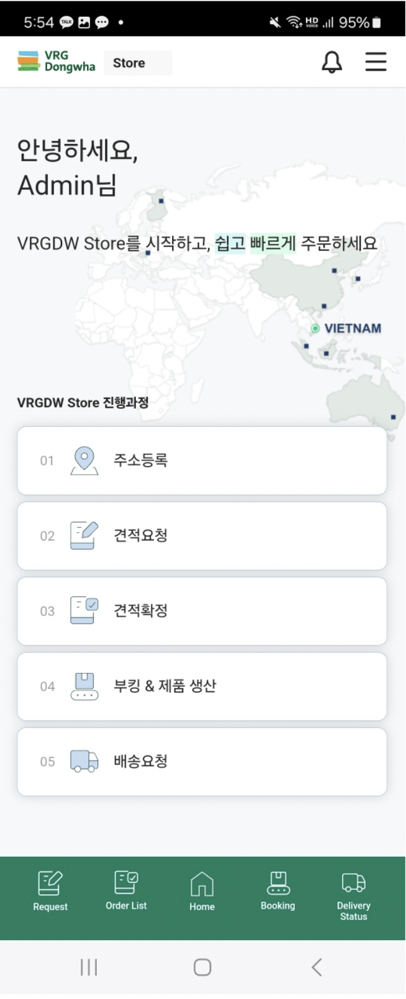
  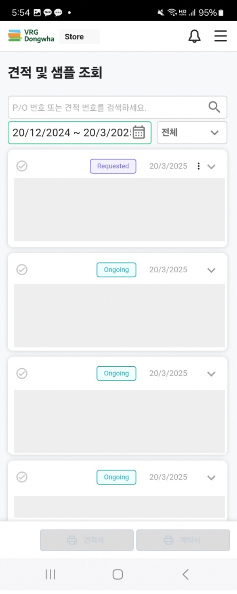
</div>

<br>

## VRGDW D-Sales (베트남 자재 영업관리 모바일 앱)

**앱명**: VRGDW D-Sales<br>
**회사**: 동화기업㈜<br>
**기간**: 2022.09.20 ~ 2023.12.31 (약 3개월)<br>
**참여 인원**: 1인 단독 개발<br>
**담당 역할**: WebView 기반 앱 전면 개발부터 배포까지 단독 수행<br>
**핵심 성과**: JS-Native 연동 구조를 안정적으로 구축하여 앱-웹 간 통신 효율성 확보
웹앱 기반 하이브리드 앱의 안정적인 서비스 오픈에 기여

### 🔍 프로젝트 소개

- 사내 베트남 지사에서의 영업, 물류 업무 프로세스를 디지털 모바일앱으로 전환한 영업 지원용 모바일 앱

### ⚙️ 기술 스택 (Technical Lead)

- **Android**: Java, WebView
- **iOS**: Objective-C, WKWebView
- **Hybrid**: Morpheus, JavaScript, jQuery, CSS
- **Native Module**: Android/iOS JS Bridge 구현
- **WebView Control**: Window, File Download, Console Redirect
- **Debugging**: Chrome DevTools, Safari Web Inspector, Remote Log
- **Security**: Proguard
- **Dependency Management**: Firebase, APNs
- **CI/CD**: CodeCommit, CodeBuild, CodeDeploy, AWS Pipeline
- **Certificate Management**: Signing, Provisioning, Key 관리
- **Monitoring**: Whatap, Google Analytics

### 🚀 주요 성과 (Key Achievements)

```sh
글로벌 대상 WebView 하이브리드 앱을 설계부터 배포까지 단독으로 개발 (구현, 테스트, 스토어 등록 전 과정 주도)
WebView 고도화로 사용자 경험(UX) 향상 실현 (URL 스킴 처리, 커스텀 팝업, 파일 다운로드 기능 최적화)
JS ↔ Native 연동 구조 커스터마이징 (브릿지 설계 및 자체 Native 모듈 개발로 웹-앱 간 통신 안정화)
플랫폼별 보안 저장소 적용으로 민감 정보 보호 강화 (Android Keystore, iOS Keychain 연동)
모바일 푸시 알림 기능 신규 도입 및 플랫폼별 적용 완료 (Android / iOS)
Google Play 및 Apple App Store 내 앱 런칭 완료 (국내/해외 배포 경험 보유)
```

<br>

<div>
  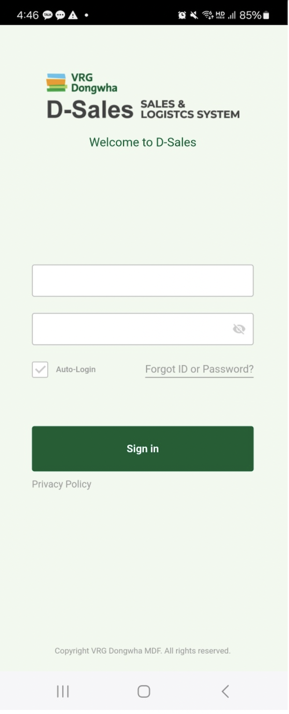
  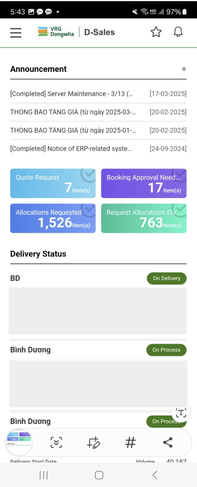
  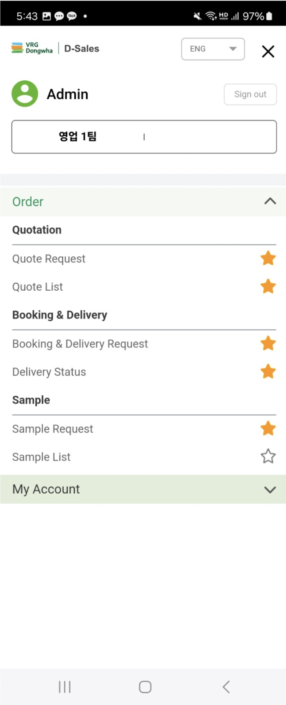
  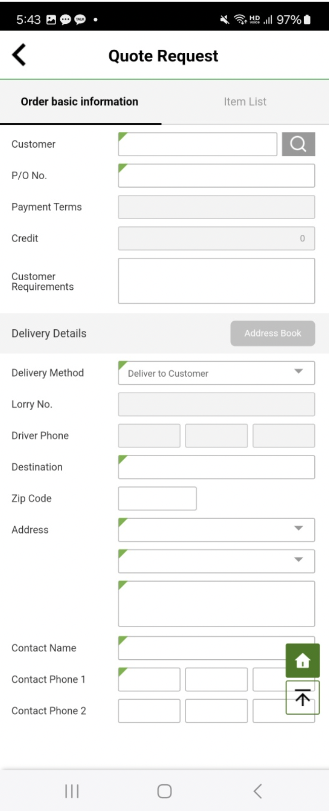
</div>

<br><br>

## IOS,Android 앱 형상관리 (Store,Enterprise)

**앱명**: Android , IOS 모바일 전체 앱 <br>
**회사**: 동화기업㈜<br>
**기간**: 2022.07.06 ~ 현재 진행중<br>
**운영 인원**: 1인 단독 운영<br>
**담당 역할**: Public Store 및 기업용(Enterprise) Android , IOS 앱 전체 운영/배포 관리<br>
**핵심 성과**: 동화 모바일 앱 약 10종 이상을 단 한 차례의 중단 없이 안정적으로 관리
외주 앱 포함 전체 모바일 운영의 단독 총괄 관리 경험 보유

### ⚙️ 기술 스택 (Technical Lead)

- **Deployment**: Google Play Console, Apple App Store, Apple Enterprise
- **Monitoring**: Whatap, Google Analytics
- **App Authentication and Security**: Apple Provisioning, Developer Certificate
- **Version Control**: Semantic Versioning

### 🚀 주요 성과 (Key Achievements)

```sh
Android SDK 업그레이드 (SDK 29 → SDK 35)
iOS 버전 대응 (iOS 13.2 → 16.2) 및 보안 정책 대응
Google / Apple 보안 정책 및 배포 가이드라인 지속 대응
FCM 메시징 v1 버전 업그레이드
Google Play Protect 미확인 앱 경고 대응
```

<div>
  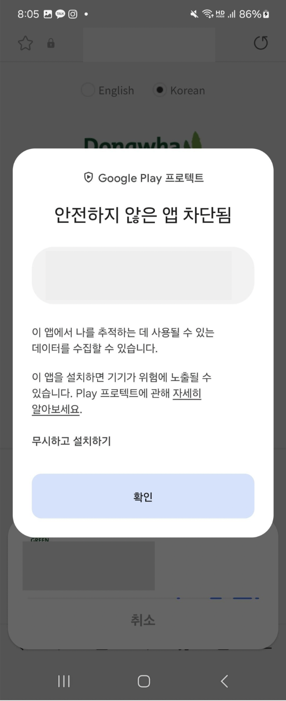
  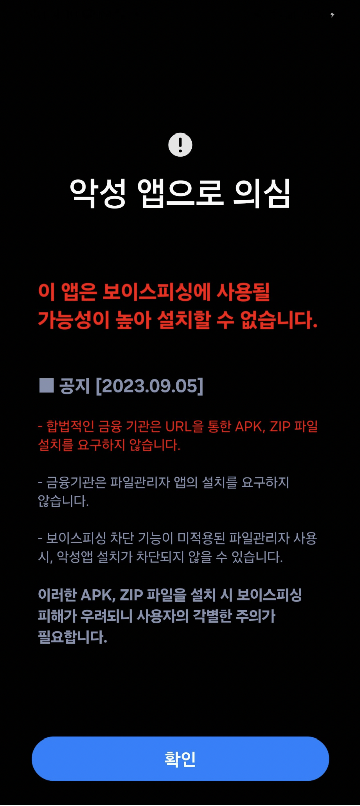
  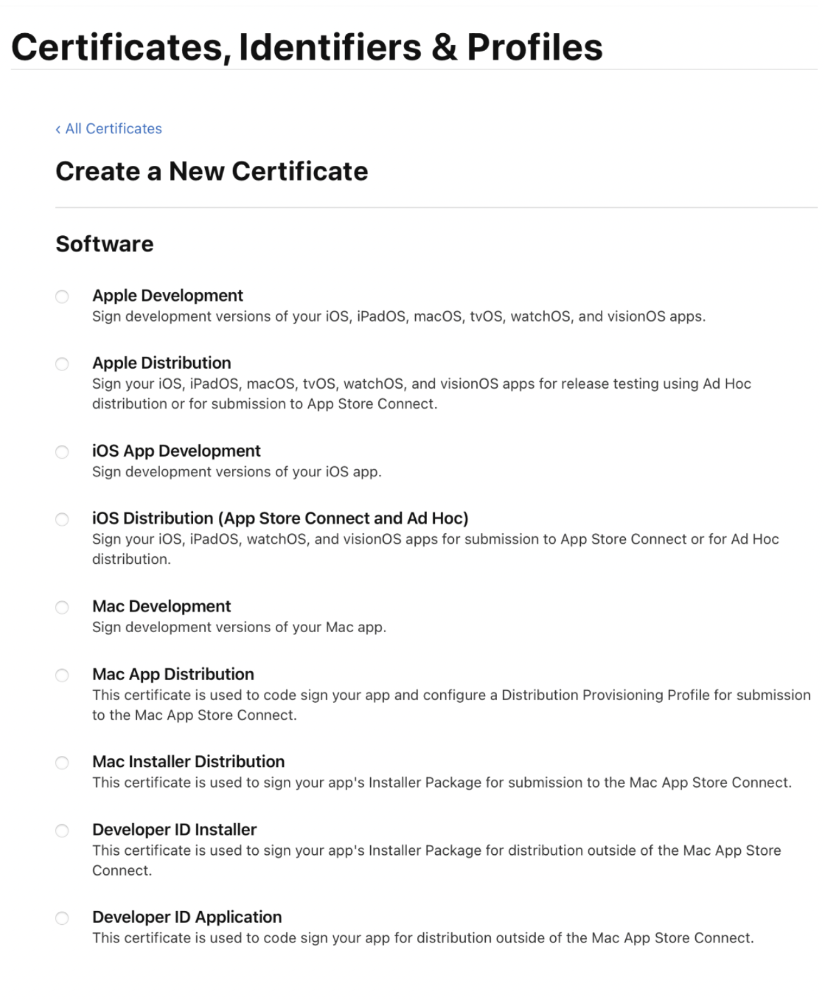
</div>

<br><br>

## 모바일 앱 서버 & 인프라 관리 (AWS, Spring)

**앱명**: Android , IOS 모바일 전체 앱 <br>
**회사**: 동화기업㈜<br>
**기간**: 2022.07.06 ~ 현재 진행중<br>
**운영 인원**: 1인 단독 운영<br>
**담당 역할**: 모바일 앱 운영에 필요한 서버 관리를 단독 수행<br>
**핵심 성과**: AWS 기반 핵심 인프라 구성요소(Aurora, Redis) 업그레이드 주도 및 무중단 이관 성공
서버 관리를 단독 수행하며 백엔드 운영의 신뢰성 및 확장성 확보

### ⚙️ 기술 스택 (Technical Lead)

- **AWS**: EC2, RDS (Aurora MySQL 8.0), ElastiCache (Redis), Route 53, CloudFront, WAF, Network ACL
- **Application Server**: Tomcat
- **Build Tool**: Maven, CodeBuild, CodeCommit
- **Framework**: Spring, MyBatis, Stored Procedure
- **Database**: MySQL
- **OS**: Linux
- **Monitoring**: Whatap, AWS CloudWatch
- **기타**: Shell Script, crontab

### 🚀 주요 성과 (Key Achievements)

```sh
모바일 앱 백엔드 서버(Spring 기반) 개발 및 유지보수
정기적인 서버 리소스 모니터링 및 튜닝 (CPU, Heap Memory, 디스크 용량 등)
AWS Aurora MySQL 업그레이드: Aurora MySQL (2.11.2 / 5.7) → Aurora MySQL (3.x / 8.0)
트래픽 제어 및 보안 설정 관리: AWS WAF, ACL 정책 구성 및 최적화
앱 연계 모바일 API 유지보수 및 신규 기능 대응
```

<div>
  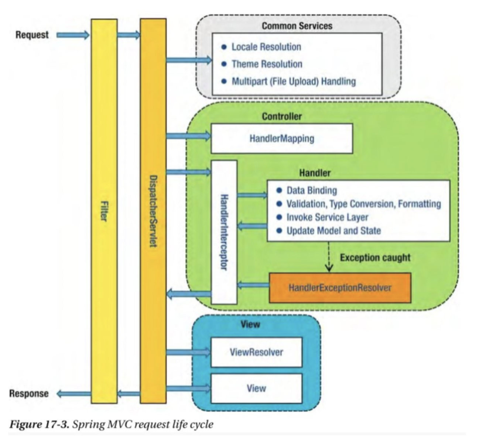
  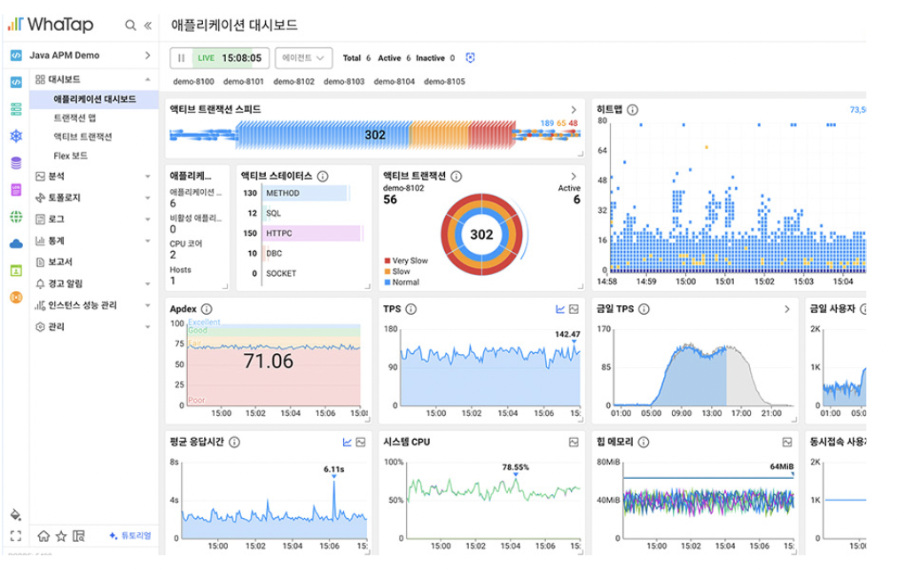
</div>

<br><br><br>

# React-Native 프로젝트

## 나하고 (임금명세서 , 출퇴근관리 , 연말정산 직원관리 모바일 앱)

**앱명**: NAHAGO <br>
**연계/소속회사**: (주)더존비즈온 <br>
**기간**: 2021.11 ~ 2022.01 (약 2개월) <br>
**참여 인원**: 6명 <br>
**담당 역할**: React Native 기반 하이브리드 앱의 다양한 인증 및 계정관리, 보안 모듈 등 전반적인 프론트엔드 개발을 전담<br>
**핵심 성과**: 단기간에 NAHAGO 신규 모바일 앱 안정적인 출시 및 운영 기여<br>

### 🔍 프로젝트 소개

- 중소기업·소상공인 등이 개정 근로기준법에서 요구하는 급여(임금)명세서 의무 교부에 쉽게 대응할 수 있도록 근무시간·
  급여관리 서비스를 제공하는 직장인용 앱 플랫폼

### ⚙️ 기술 스택 (Technical Lead)

- **React Native**: TypeScript, JavaScript
- **State Management**: Redux, Redux Toolkit, Redux-Observable, React Context, React Query
- **React**: Hooks 기반 함수형 컴포넌트로 개발, Class → Function Component 전환 경험
- **Architecture**: Clean Architecture
- **Reactive Programming**: ReactiveX
- **Authentication & Authorization**: OAuth 2.0, Self-authentication, Fingerprint, Face ID, Simple Auth
- **API Integration**: RESTful API, Axios, Retrofit , ajax , fetch
- **Native Module**: Android Java/Kotlin
- **Security**: Proguard, Rooting Guard, RSA, AES, App Signature
- **Dependency Management**: NPM, CocoaPods, Gradle, Shell Script

### 🚀 주요 성과 (Key Achievements)

```sh
앱 스플래시 및 로그인/회원가입 화면 개발
계정 관리 기능 구현 (회사 추가/해지, 간편비밀번호, 아이디/비밀번호 찾기 등)
위하고앱 연동 기능 개발 및 통합 테스트 수행
본인확인 모듈 구축 (PIN, Face ID, FIDO, NICE 인증 연동)
보안툴 암호화 모듈 세팅 & 전자서명 인증서 개발
```

<div>
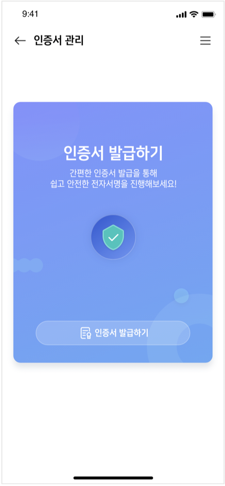
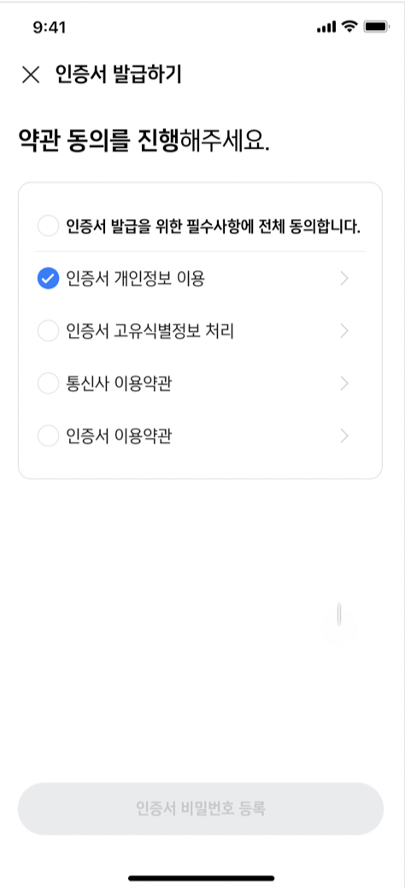
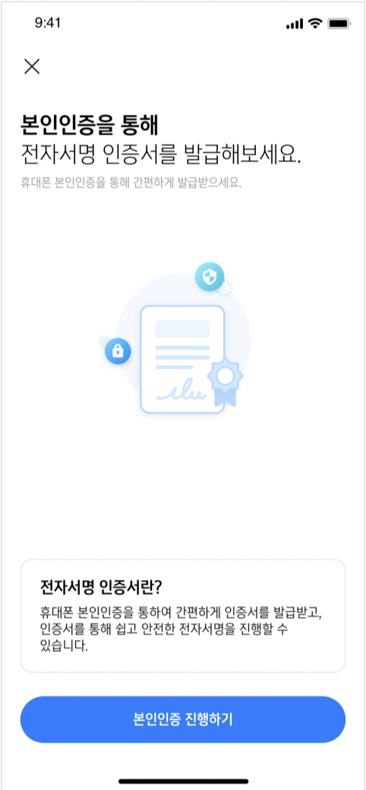
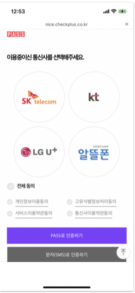
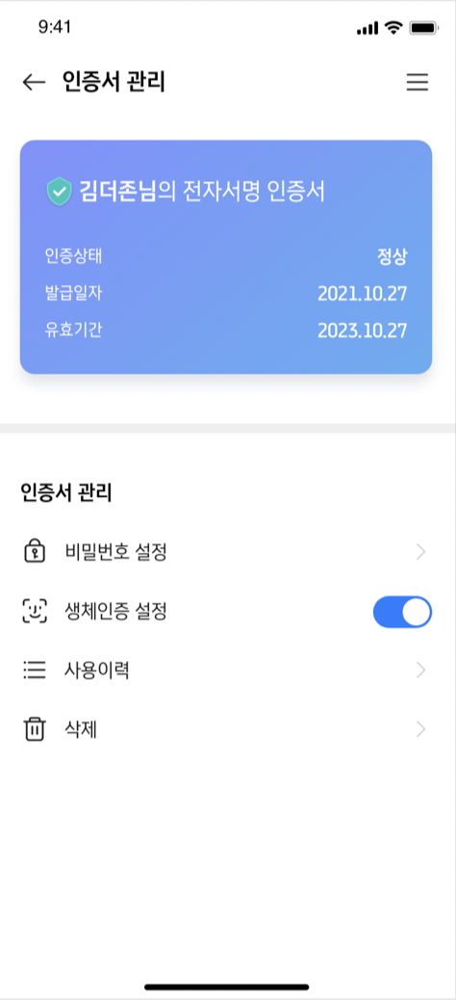
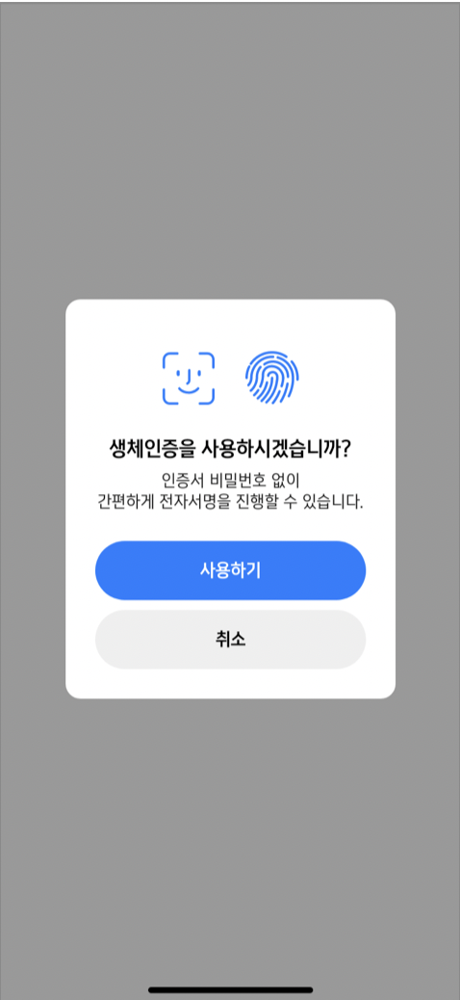
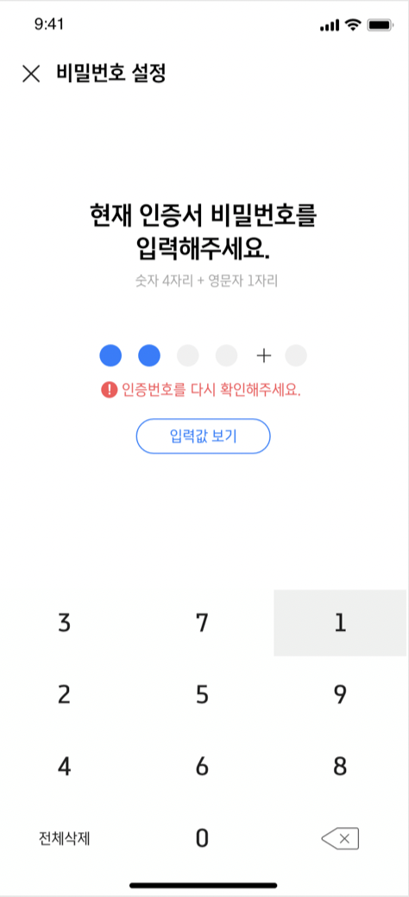


</div>

## 나야나 -> 우리도(강원도청 플렛폼 앱)

**앱명**: 우리도 <br>
**연계/소속회사**: 강원도청 / (주)더존비즈온 <br>
**기간**: 2020.07 ~ 2021.03 (약 7개월) <br>
**참여 인원**: 4명 <br>
**담당 역할**: React Native 기반 하이브리드 앱의 프론트엔드 개발을 전담하며 주요 기능(UI/로직) 구현에 참여<br>
**핵심 성과**: 음성·화상 통화, 명함 촬영, 알림톡 등 핵심 모듈을 안정적으로 구현하여 강원도민을 위한 React-Native 하이브리드 모바일 우리도 앱 출시 및 품질 고도화에 기여
<br>

### 🔍 프로젝트 소개

- 개인의 신원·자격을 안전하게 증명할 수 있는 블록체인 기반의 분산신원증명(DID) 및 클라우드 기술이 적용된 앱으로써. 강원도민 사람들 위주로 비대면 신원인증 서비스를 통해 주민센터 등 기관 방문 없이 휴대폰으로 각종 보조금을 신청하거나 지급받을 수 있는 앱입니다

### ⚙️ 기술 스택 (Technical Lead)

- **React Native**: TypeScript, JavaScript
- **Native Module**: Android Java/Kotlin
- **State Management**: Redux, Redux Toolkit, redux-observable, Middleware
- **React**: Class Component
- **Reactive Programming**: ReactiveX
- **Real-Time Communication**: Jitsi-Meet 커스터마이징, WebRTC
- **Architecture**: Clean Architecture
- **API Integration**: RESTful API, Ajax, fetch
- **Local Storage & Caching**: SQLite, TypeORM, Secure Storage (Keychain, Keystore)
- **Security**: Proguard, Rooting Guard, RSA, AES
- **Dependency Management**: Yarn, CocoaPods, Gradle, Shell Script
- **Cloud Platform**: Firebase

### 🚀 주요 성과 (Key Achievements)

```sh
로그인/회원가입 및 사용자 프로필 화면 개발
강원마트 기능 구현 및 쇼핑 UI 구성
음성/화상 통화 기능 개발 (Jitsi-Meet 기반 WebRTC)
명함 모듈 및 카메라 연동 기능 개발
알림톡 및 노티카운트 기능 구현
```

<div>


</div>

<br>

## 위하고원(블록체인 간편계약 모바일 앱)

**앱명**: WehagoOne <br>
**연계/소속회사**: 정부과제 -> (아이콘루프 / 더존비즈온)<br>
**기간**: 2020.07 ~ 2021.03 (약 7개월) <br>
**참여 인원**: 4명 <br>
**담당 역할**: React Native 기반 하이브리드 앱의 프론트엔드 전담, 로그인/회원가입 및 음성·화상 기능, 계약 채팅방 알림톡 프로세스 개발<br>
**핵심 성과**: 블록체인 간편계약 앱 개발 및 정부과제 성공 판정 -> 정부 지원금 지급 및 성과 인정<br>

### 🔍 프로젝트 소개

- 정부 프로젝트 과학기술정보통신부·한국인터넷진흥원(KISA)의 ‘2020 블록체인 민간주도 국민 프로젝트’ 선정 과제로 선보인 블록체인 기술 기반의 소상공인과 개인을 위한 간편계약(구두계약) 앱 플랫폼

### ⚙️ 기술 스택 (Technical Lead)

- **React Native**: TypeScript, JavaScript
- **Native Module**: Android Java/Kotlin
- **State Management**: Redux, Redux Toolkit, redux-observable, Middleware
- **React**: Class Component
- **Reactive Programming**: ReactiveX
- **Real-Time Communication**: Jitsi-Meet 커스터마이징, WebRTC
- **Architecture**: Clean Architecture
- **API Integration**: RESTful API, ajax, fetch
- **Local Storage & Caching**: SQLite, TypeORM, Secure Storage (Keychain, Keystore)
- **Security**: Proguard, Rooting Guard, RSA, AES
- **Dependency Management**: Yarn, CocoaPods, Gradle, Shell Script
- **Cloud Platform**: Firebase

### 🚀 주요 성과 (Key Achievements)

```sh
  로그인/회원가입 UI 및 상태 관리 구현
  계약 채팅방 생성 프로세스 로직 구현
  음성/화상 채팅, 녹화 기능(Jitsi-Meet + WebRTC) 연동
  녹화된 영상/음성 기반 채팅 및 알림톡 기능 개발
```

<div>


</div>

## 위하고 Sign (회사 전자서명 앱)

**앱명**: WehagoSign <br>
**연계/소속회사**: (주)더존비즈온<br>
**기간**: 2020.02 ~ 2020.04 (약 3개월) <br>
**참여 인원**: 1명 <br>
**담당 역할**: 사내 전자서명 앱 React Native 기반 하이브리드 앱의 프론트엔드 개발을 전담 <br>
**핵심 성과**: 회사 내 최초로 React-Native 프로젝트 도입성공 & React-Native + Redux 상태관리 사내 전체 교육 진행(+테크톡) <br>

### 🔍 프로젝트 소개

- 중소기업·소상공인 등이 비대면으로 플랫폼 자체내에 회사 서명 업무를 진행 및 관리를 할수있게 서비스를 제공하는 직장인용 앱 플랫폼입니다

### ⚙️ 기술 스택 (Technical Lead)

- **React Native**: Expo, TypeScript, JavaScript
- **Native Module**: Android Java/Kotlin, iOS
- **React**: Class Component 기반 개발 – componentDidMount, componentDidUpdate 등 Lifecycle 활용
- **State Management**: Redux, redux-observable
- **Reactive Programming**: ReactiveX
- **Architecture**: Clean Architecture
- **Authentication & Authorization**: OAuth 2.0
- **API Integration**: RESTful API, ajax, fetch
- **Security**: Proguard, Rooting Guard, RSA, AES
- **Local Storage & Caching**: SQLite, Secure Storage (Keychain, Keystore)
- **Dependency Management**: Yarn, Shell Script
- **Cloud Platform**: Firebase

### 🚀 주요 성과 (Key Achievements)

```sh
사내 전자서명 시스템을 모바일로 구현
Sign-Then-Encypt (RSA + AES + Signature) 을 이용한 보안 인증서 개발
앱 전체 UI , 인증 흐름, 전자서명 로직 구현 및 테스트
아키텍쳐 설계 (Redux-observable) 최초 도입
```

<div>


</div>

---

<br><br>

# Android 프로젝트

## 위하고 And 앱(B to B 협업) 유지보수/고도화

**앱명**: Wehago <br>
**연계/소속회사**: (주)더존비즈온<br>
**기간**: 2019.07 ~ 2022.01 (2년 7개월) <br>
**참여 인원**: 4명 <br>
**담당 역할**: : Android 프론트엔드 유지보수 및 기능 고도화 <br>
**핵심 성과**: 대규모 B2B 협업 플랫폼의 핵심 화면과 기능을 안정적으로 유지보수 <br>

### 🔍 프로젝트 소개

- 기업의 다양한 업무환경에 필요한 온라인 비즈니스 플랫폼으로써 (원활한 소통, 효율적인 업무관리, 서비스연동, 신속한 업무처리, 안전한 데이터관 리등)의 서비스를 제공하는 모바일 앱입니다

### ⚙️ 기술 스택 (Technical Lead)

- **Android**: Java, Kotlin
- **Architecture**: Clean Architecture, AAC
- **Reactive Programming**: ReactiveX
- **API**: Retrofit, Gson, OkHttp
- **Network**: RESTful API
- **Push**: Firebase Cloud Messaging
- **Storage**: SharedPreferences, SQLite
- **Security**: Proguard
- **Dependency Management**: Firebase, Gradle

### 🚀 주요 성과 (Key Achievements)

```sh
연락처 내보내기/가져오기 기능 개발
연락처 단어별 검색 기능 및 UI 개선
거래처 요금제 분기별 서비스 로직 구현
거래처 휴지통 기능 신규 개발
영어/일본어 로컬라이징 적용
뉴스/조직도/공지사항/잠금설정 등 100건 이상의 Jira QA 이슈 처리
```

##### 메인/뉴스

<div>


</div>

##### 연락처

<div>


</div>

##### 거래처

<div>


</div>

##### 설정/기타

<div>


</div>

<br>

## 한글공부 한글천재(인턴)

**앱명**: 한글공부 한글천재 <br>
**연계/소속회사**: (주)클루소프트 <br>
**기간**: 2017.12.21-2018.02.14 <br>
**참여 인원**: 2명 <br>
**담당 역할**: 한글그리기 모션 개발 + 영상 플랫폼 실행 <br>
**핵심 성과**: 한국어교육 앱 플랫폼 Android 앱 출시 <br>

### 🔍 프로젝트 소개

- '한글공부 한글천재 앱'은 한국어교육,난독중극복 및 언어치료에 도움을 주는 한글교육앱 플랫폼

### ⚙️ 기술 스택 (Technical Lead)

- **Android**: Java, Android Studio
- **Drawing**: Canvas, Paint, Path, Bitmap
- **Video Playback**: VideoView, MediaPlayer
- **Touch Event Handling**: onTouchEvent
- **Cache**: SQLite
- **Security**: Proguard, Rooting Guard

### 🚀 주요 성과 (Key Achievements)

```sh
  그리기 모션 인식
  메인 개발
  영상 재생 개발
```

**플랫폼 소개 영상 :** https://www.youtube.com/watch?v=OSsHPK1mCjo

<div>


</div>

## 한글공부 게임 (대학교 프로젝트)

**앱명**: HangleStudy <br>
**개발 기간**: 2017.12.21-2018.02.14 <br>
**참여 인원**: 1명 <br>

### 🔍 프로젝트 소개

- 인턴 당시 만들었던 한글교육 한글천재에 영감을 얻고 고도화해서 게임형식으로 만든 대학교 프로젝트 입니다

### ⚙️ 기술 스택 (Technical Lead)

- **Android**: Java, Android Studio
- **Drawing**: Canvas, Paint, Path, Bitmap
- **Video Playback**: VideoView, MediaPlayer
- **Touch Event Handling**: onTouchEvent
- **Cache**: SQLite
- **Security**: Proguard, Rooting Guard

### 🚀 주요 성과 (Key Achievements)

```sh
  그리기 모션 인식
  메인 개발
  영상 재생 개발
  회원가입,로그인 기능 개발
  앱 1인 개발
```

<div>


</div>

<br><br>

# Unity C# 프로젝트

## AR/VR 소화기 분사 플랫폼(인턴)

**회사**: (주)제튼 <br>
**기간**: 2017.12.21-2018.02.14 <br>
**참여 인원**: 1명 <br>

### 🔍 프로젝트 소개

- AR/VR 증강/가상현실속 화재상황시 직접 소화기 분사를 진행해보면서 실제로 이와같은 상황이 발생했을때
  화재 대처능력을 기를수있게 도와주는 앱 플랫폼입니다

### ⚙️ 기술 스택 (Technical Lead)

- **Unity**: C#, Vuforia, VR Cardboard

### 🚀 주요 성과 (Key Achievements)

```sh
  소화기 분사 1인 개발
```

**실행 동영상 :** https://www.youtube.com/watch?v=5yDfrHHk-Uk

<div>


</div>

## VR 화재안전 플랫폼(인턴)

**회사**: (주)제튼 <br>
**기간**: 2019.02 ~ 2019.03 <br>
**참여 인원**: 3명 <br>

### 🔍 프로젝트 소개

- AR/VR 증강/가상현실속 화재상황시 대피요령을 학습함으로써 실제로 이와같은 상황이 발생했을때
  화재 대피능력을 기를수있게 도와주는 앱 플랫폼입니다

### ⚙️ 기술 스택 (Technical Lead)

- **Unity**: C#, Vuforia, VR Cardboard

### 🚀 주요 성과 (Key Achievements)

```sh
  텍스트 타이핑 애니메이션 개발
  충돌처리 및 파티클 개발
  핸드폰 기울기에 따른 VR 캐릭터 움직임 개발
```

**실행 동영상 :** https://www.youtube.com/watch?v=AlTTtl3l7lA

<div>


</div>

## VR 화재 체험 플랫폼 (인턴)

**소속**: 한림대학교 <br>
**기간**: 2018.09 ~ 2018.12 <br>
**참여 인원**: 5명 <br>

### 🔍 프로젝트 소개

- 'VR 화재 체험 플랫폼은' (주)제튼 회사에서 배웠던 기술들을 활용하여 졸업 프로젝트로 가상세계에서의 화재상황을 발생시켜
  화재시 대피하는 요령을 VR을 통해 체험하는 플랫폼을 만들었습니다

### ⚙️ 기술 스택 (Technical Lead)

- **Unity**: C#, Virtual Reality, OVRPlayerController

### 🚀 주요 성과 (Key Achievements)

```sh
 캐릭터 움직임 제어 개발
 타겟 충돌처리 & 이벤트 처리 개발
 불 파티클 개발,음성개발
 캐릭터 응시점 개발
```

<div>


</div>
