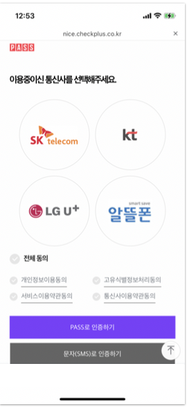
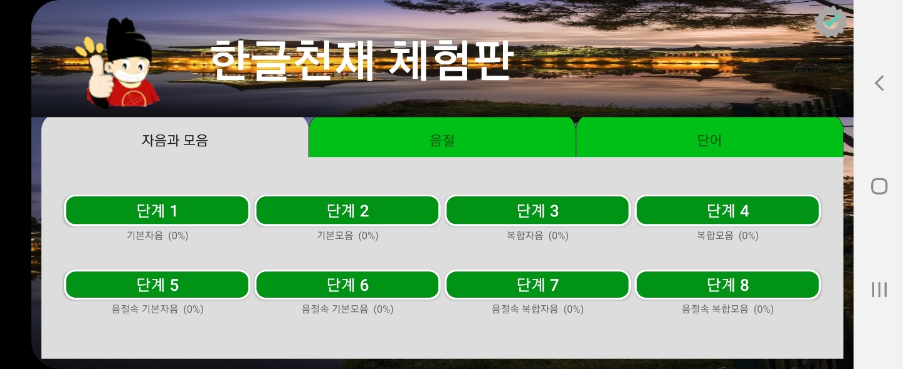
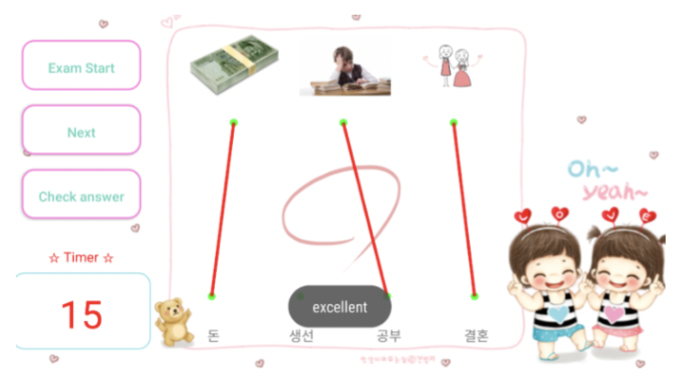

# 노원상

안녕하세요 Android , React-Native , Cross-Platform(Android,IOS) ,서버 (Spring) 경험이 있는 5년차 개발자 노원상 연구원입니다
제가 맡게된 임무를 책임감 있게 마무리하는 개발자가 되는것 열정을 잃지 않고 끈임없이 성장해 나가는
그런 개발자가 되도록 노력하는것이 저의 방향이자 목표입니다.
그렇기에 현실에 안주하지 않고 더 좋은 방향으로 성장해 나아가길 선호하는 편입니다.
최근 수행한 회사업무에서 연구원 경력에 대리팀장을 도맡아 개발팀을 이끌어보았던 경력이 있고 협의,회의를 통해
성공적으로 서비스를 운영할수 있도록 전체적인 진행을 총괄한 경험이 있습니다.

# 경력

- (주)동화기업 (정규직활동 2022.07.05 ~ 진행중)
  - [동화기업 회사 정보확인](https://www.dongwha.com/main/main.asp)
- (주)더존비즈온 (정규직활동 2019.07.15 ~ 2022.01.13)
  - [더존비즈온 회사 정보확인](https://www.jobplanet.co.kr/companies/81407/landing/%EB%8D%94%EC%A1%B4%EB%B9%84%EC%A6%88%EC%98%A8)
- (주)제튼(인턴활동 2019.02 ~ 2019.06)
  - [제튼 회사 정보확인](<https://www.saramin.co.kr/zf_user/company-info/view/csn/VUVwS0RuV0hsTDJGUnBmWG5WaVkxdz09/company_nm/(%EC%A3%BC)%EC%A0%9C%ED%8A%BC>)
- (주)클루소프트(인턴활동 2018.06 ~ 2018.08)
  - [클루소프트 회사 확인](<https://www.saramin.co.kr/zf_user/company-info/view/csn/bDd0Rmx6UWM3d0VjTENDYlhtLzIvZz09/company_nm/(%EC%A3%BC)%ED%81%B4%EB%A3%A8%EC%86%8C%ED%94%84%ED%8A%B8>)

# 보유 기술


- React-Native(TypeScript,JavaScript)
  - 4개의 앱 개발
- Android(Java,kotlin)
  - 3개의 앱 개발
- 하이브리드 앱(Morpheus,Java,Object-C,jquery,Spring,Mysql,AWS)
  - 약 5개의 앱 유지보수
- 하이브리드 웹앱(Morpheus,WebView,Native bridge)
  - 2개의 앱 유지보수
  - 2개의 앱 개발
- VR/AR(C#)
  - unity를 이용한 3개의 교육앱 개발

# 관리

- Company Manament

```sh
  개발프로세스: JIRA를 통한 이력 및 일정관리
  문서화: Confluence(WiKi) 활용
  보고서: 일일 보고서, 주간 보고서, 월간 보고서
```

- People Management

```sh
  교육: 회사 테크톡발표 , React-Native 교육 , redux 아키텍쳐 교육, Native kotlin 교육 제공
```

<div>
<a href="https://github.com/nowonsang/portfolio/blob/main/images/education/education1_file.pdf">

</a>
<a href="https://github.com/nowonsang/portfolio/blob/main/images/education/education2_file.pdf">

</a>
<a href="https://github.com/nowonsang/portfolio/blob/main/images/education/education3_file.pdf">

</a>
</div>

## <br>

# hybrid 프로젝트

## 하이브리드 앱 (직원관리,원재료 관리,자재 영업관리,대리점 영업관리 모바일 앱) 유지보수/고도화

> <br>유지보수 : 2022.07.05 ~ 현재진행중 <br><br>
> (주)동화기업 > 모바일담당 (노원상 대리) <br><br>
> 대상앱: GreenNet, D-RMS , D-Sales, D-Partners , It-service <br><br>

- Introduction

```sh
'그린넷(GreenNet)', 'D-RMS', 'D-Sales', 'D-Partners', 'it-service' 5가지 모바일 앱은
사내 자재 관리 및 특정 목질 원재료의 출고 관리와 출고 처리 기능을 제공하며,
영업 관리에 필요한 자재 주문, 출고, 시공, A/S, 배송 시스템, 원재료 관리 등을 지원합니다.
또한, 결재, 직원 관리, 조직 문화, 이슈 관리 등 회사 전반에서 발생하는 다양한 행위와 업무 처리를 통합적으로 지원하는 모바일 애플리케이션입니다.
```

- Technical Lead

```sh
  And(Java17,RxJava,Webview)
  ios(Object-C,WKWebView)
  CrossPlatform(Morpheus,javaScript,jQuery,CSS)
  Network(RestfulApi,Spring)
  Monitoring(Whatap,crashReport)
  DB(Mysql)
  Pattern(MVC)
  Security(Proguard,RSA, AES)
  Dependency managment(firebase,Upns,Apns)
  CI/CD(CodeCommit)
```

- Key Responsibilities

```sh
  [1인 유지보수 & 고도화 및 신규개발]

  모바일 로그인 통합체계 개발 (AD인증 -> M365 oAuth 로그인)
  모바일 push 디테일 컨트롤 기능 개발 (전자결재 -> IOS,Android 뱃지 카운트 동기화)
  모바일 AI 스마트렌즈 개발 (자재 패턴정보 분석,추천)
  Web <-> 모바일 앱 Connect 단축링크 개발
  모바일 (원지재고 조회,BI 서비스, 휴가신청, 인포메이션, 업무서비스, 긴급공지사항) 신규개발
  모바일 AS 기사/특판 ImagePicker 쟈체개선 (이미지 로드 속도 약 10초 → 1초 , 저화질 -> 초고화질)

  약 150개이상의 개선개발 및 & 자체개선 & 이슈처리 (GreenNet, D-RMS, D-Sales, D-Partners, IT-Service)
```

<br>

<div>


</div>

<br>

## 하이브리드 웹앱 (생산관리,운송사관리,운송장,베트남 원재료관리) 유지보수/고도화

> <br>유지보수 : 2022.07.05 ~ 현재진행중 <br><br>
> (주)동화기업 > 모바일담당 (노원상 대리) <br><br>
> 대상앱 : D-Logis, Smart-Factory, D-RMS VN <br><br>

```sh
'D-Logis', 'Smart-Factory', 'D-RMS VN' 3개의 모바일앱은
배송 기사들이 운송장을 효율적으로 출력하여 고객에게 정확한 제품을 전달할 수 있도록 지원하고,
공정 현황과 제품 오더 스케줄을 데이터와 연계하여 관리하며,
베트남 지역의 원재료를 효율적으로 관리하고 업무를 처리할 수 있도록 돕는 모바일 애플리케이션입니다.
```

- Technical Lead

```sh
  And(Java17,Webview)
  ios(Object-C,WKWebView)
  CrossPlatform(Morpheus,javaScript,jQuery,CSS)
  Native Bridge (ios/android)
  Security(Proguard)
  Dependency managment(firebase,Upns,Apns)
  CI/CD(CodeCommit)
```

- Key Responsibilities

```sh

  [1인 유지보수 및 고도화]

  파일 다운로드 기능 추가
  서브앱 로그인 기능 추가
  Web <-> Native Bridge 모듈 개발 (토스트 메세지표시,앱스토리지 저장/조회,시스템 브라우저 호출, 앱전역변수 저장/조회)

```

<br>

<div>
  
  
  
  
  
  
</div>

## VRGDW Store (베트남 고객용 주문관리 모바일 앱)

> <br>개발기간 : 2023.11.20 ~ 2024.01.25 <br><br>
> (주)동화기업 > 모바일담당 (노원상 대리) <br><br>

```sh
'VRGDW Store'는 고객이 모바일로 제품을 주문하고, 주문 현황과 보고서를 확인할 수 있는 비즈니스 전용 모바일 애플리케이션입니다.
```

- Technical Lead

```sh
  And(Java17,Webview)
  ios(Object-C,WKWebView)
  CrossPlatform(Morpheus,javaScript,jQuery,CSS)
  Native Bridge (ios/android)
  Security(Proguard)
  Dependency managment(firebase,Upns,Apns)
  CI/CD(CodeCommit)
```

- Key Responsibilities

```sh
  [1인 개발]

  WebView,WKWebView 새로고침 모션 추가
  push 알림 추가
  Web <-> Native Bridge 모듈 개발 (토스트 메세지표시,앱스토리지 저장/조회,시스템 브라우저 호출, 앱전역변수 저장/조회)
  GooglePlay 공개 배포
  AppStore 비공개 배포
```

<br>

<div>
  
  
  
</div>

<br>

## VRGDW D-Sales (베트남 자재 영업관리 모바일 앱)

> <br>개발기간 : 2022.09.20 ~ 2023.12.31 <br><br>
> (주)동화기업 > 모바일담당 (노원상 대리) <br><br>

```sh
'VRGDW D-Sales' 모바일앱은 베트남 지역에서의 수기로 이루어지던 영업, 물류 업무 프로세스를 디지털 전환하여 휴먼 에러를 줄이고 업무 효율성을 높여 이용 고객의 편의성을 높이고자
만든 영업 지원용 모바일 애플리케이션입니다.
```

- Technical Lead

```sh
  And (Java17,Webview)
  ios (Object-C,WKWebView)
  CrossPlatform (Morpheus,javaScript,jQuery,CSS)
  Native Bridge (ios/android)
  Security (Proguard)
  Dependency managment (firebase,Upns,Apns)
  CI/CD (CodeCommit)
```

- Key Responsibilities

```sh
  [1인 개발]

  WebView,WKWebView 새로고침 모션 추가
  push 알림 추가
  Web <-> Native Bridge 모듈 개발 (토스트 메세지표시,앱스토리지 저장/조회,시스템 브라우저 호출, 앱전역변수 저장/조회)
  GooglePlay 공개 배포
  AppStore 비공개 배포
```

<br>

<div>
  
  
  
  
</div>

<br><br>

## IOS,Android 앱 현상관리 (Store,Enterprise)

> <br>유지보수 : 2022.07.05 ~ 현재진행중 <br><br>
> (주)동화기업 > 모바일담당 (노원상 대리) <br><br>

- Technical Lead

```sh
  And (GoogleStore,Release apk)
  ios (AppStore,Enterprise)
```

- Key Responsibilities

```sh
[Android]

Android SDK 29 -> SDK 35 배포
Google 보안정책 변경대응 (Android)
Google 프로텍트 감지 & 출처 미상 App 대응
FCM -> HTTP v1로 변경작업 진행

[IOS]

Xcode (13.2 -> 16.2)
Apple 보안정책 변경대응 (IOS)
IOS (기업용,스토어용 계정) 관리
IOS 인증서 관리 (push,profile,distriution)
APNS 인증서 (p12 -> p8) 변환작업 적용 (Sandbox+Product)
배포관리 (비공개배포,공개배포)
```

<div>
  
  
  
</div>

<br><br>

## 모바일 앱 서버 & 인프라 관리 (AWS, Spring)

> <br>유지보수 : 2022.07.05 ~ 현재진행중 <br><br>
> (주)동화기업 > 모바일담당 (노원상 대리) <br><br>

- Technical Lead

```sh
  AWS (EC2, RDS, Redis, Route 53, Network ACL, CloudFront, Waf)
  Application Server (Tomcat8)
  Build Tool (Maven)
  Framework (Spring Framework 4, MyBatis, Stored Procedure)
  Architecture Pattern (MVC)
  Database: (MySQL)
  Security: (JWT, RSA, AES, OAuth)
  OS: (Linux)
  Monitoring: (Whatap)
```

- Key Responsibilities

```sh
  [1인 유지보수]

   모바일 API 개발 및 정기적인 유지보수(서버용량 관리 , CPU 관리, Heap Memory 관리)
   Aurora Mysql(2.11.2) 5.7 → Aurora Mysql(3.0.x) 8.0 (메이저 업그레이드 진행)
   Redis 클러스터 (3.2.10) -> Redis (7.0.7) 업그레이드 진행
   인프라 트래픽관리 (WAF,ACL)
```

<div>
  
  
</div>

<br><br>

---

<br><br><br>

# React-Native 프로젝트

## 나하고 (임금명세서 , 출퇴근관리 , 연말정산 직원관리 모바일 앱)

> 개발기간 : 2021.11.28 ~ 현재 진행중
> (주)더존비즈온 > 모바일개발팀(노원상 연구원)

- Introduction

```sh
 '나하고(NAHAGO)앱'은 중소기업·소상공인 등이 개정 근로기준법에서 요구하는 급여(임금)명세서 의무 교부에 쉽게 대응할 수 있도록 근무시간·
 급여관리 서비스를 제공하는 직장인용 앱 플랫폼입니다
```

- Technical Lead

```sh
 Dependency managment(npm, pods, gradle, python script )
 Redux pattern(Redux-observable,Redux Hook)
 certification(self-authentication,fingerPrint,faceID,simple authentication)
 CI/CD(Gitlab, Fastlane)
```

- Participation

```sh
  앱 스플래시,회원가입/로그인 개발
  계정관리(요금제 해지,비밀번호찾기,아이디찾기,간편비밀번호찾기,로그아웃,회사추가,회사해지)개발
  위하고앱 연동 개발
  본인부인방지 모듈 제작(PIN,FACE ID,FIDO,NICE 인증)
  보안툴 암호화 모듈 세팅 & 계약 인증서 개발
```

<div>





</div>

## 나야나(강원도청 플렛폼 앱)

> 개발기간 : 2020.07 ~ 2021.03
> (주)더존비즈온 > 모바일개발팀(노원상 연구원)

- Introduction

```sh
 나에게 맞춰진 디지털 세상, 내가 중심인 디지털 세상을 뜻하는 '나야나(NAYANA) 앱'은 핸드폰 만으로 언제 어디서나 개인의 신원·자격을 안전하게 증명할
 수 있는 블록체인 기반의 분산신원증명(DID) 및 클라우드 기술이 적용된 앱으로써. 강원도민 사람들 위주로 비대면 신원인증 서비스를 통해 주민센
 터 등 기관 방문 없이 휴대폰으로 각종 보조금을 신청하거나 지급받을 수 있는 앱입니다
```

- Technical Lead

```sh
  React-Native(TypeScript, junit, Objective-C, Java,kotlin)
  Redux pattern(redux-observable)
  Cache(SQLite, Typeorm)
  Security(Proguard, Rooting guard, RSA, AES)
  Dependency managment(yarn, pods, gradle, python script,firebase)
  CI/CD(Gitlab, Fastlane)
```

- Participation

```sh
  로그인/회원가입 개발
  프로필 개발
  강원마트 개발
  음성/화상 서비스 개발 및 고도화(Jitsi-Meet Library and webRTC)
  명함 모듈/카메라 모듈 개발 및 고도화
  알림톡/노티카운트 개발
```

<div>


</div>

## 위하고원(블록체인 간편계약 모바일 앱)

> 개발기간 : 2020.07 ~ 2021.03
> (주)더존비즈온 > 모바일개발팀(노원상 연구원)

- Introduction

```sh
 'WEHAGO ONE 앱'은 정부 프로젝트 과학기술정보통신부·한국인터넷진흥원(KISA)의 ‘2020 블록체인 민간주도 국민 프로젝트’ 선정 과제로 선보인 블록체인 기
 술 기반의 소상공인과 개인을 위한 간편계약(구두계약) 앱 플랫폼입니다
```

- Technical Lead

```sh
  React-Native(TypeScript, junit, Objective-C, Java)
  Redux pattern(redux-observable)
  Cache(SQLite, Typeorm)
  Security(Proguard, Rooting guard, RSA, AES)
  Dependency managment(yarn, pods, gradle, python script,firebase)
  CI/CD(Gitlab, Fastlane)
```

- Participation

```sh
  로그인/회원가입 개발
  음성/화상 개발 & 녹화 서비스 적용(Jitsi-Meet Library and webRTC)
  계약 채팅생성 프로세스 개발
  녹화 음성파일,녹화 화상파일,화상대화,음성대화 채팅 알림톡 개발
```

<div>


</div>

## 위하고 Sign (회사 전자서명 앱)

> 개발기간 : 2020.02 ~ 2020.04
> (주)더존비즈온 > 모바일개발팀(노원상 연구원)

- Introduction

```sh
 '위하고 SIGN 앱'은 중소기업·소상공인 등이 비대면으로 플랫폼 자체내에 회사 서명 업무를 진행 및 관리를 할수있게 서비스를 제공하는
 직장인용 앱 플랫폼입니다
```

- Technical Lead

```sh
  React-Native(TypeScript, Expo)
  Redux pattern(redux-observable)
  Security(Proguard, Rooting guard, RSA, AES)
  Dependency managment(yarn,python script,firebase)
  CI/CD(Gitlab, FastLane)
```

- Participation

```sh
  앱 1인 개발
```

<div>


</div>

---

<br><br>

# Android 프로젝트

## 위하고 And 앱(B to B 협업) 유지보수/고도화

> 개발기간 : 2019.05 ~ 진행중
> (주)더존비즈온 > 모바일개발팀(노원상 연구원)

- Introduction

```sh
 '위하고(WEHAGO) 앱은' 기업의 다양한 업무환경에 필요한 온라인 비즈니스 플랫폼으로써 (원활한 소통, 효율적인 업무관리, 서비스연동, 신속한 업무처리, 안전한 데이터관 리등)의
 서비스를 제공하는 모바일 앱입니다
```

- Technical Lead

```sh
  And(kotlin,Java12,RxJava)
  Network(RestfulApi)
  Pattern(MVC)
  Security(Proguard,RSA, AES)
  Dependency managment(firebase)
  CI/CD(Gitlab, FastLane)
```

- Participation

```sh
  연락처 서비스 디바이스에 데이터 내보내기/가져오기 개발
  연락처 단어별 검색기능 개발
  거래처 서비스 요금제별 분기 적용 개발
  거래처 휴지통 기능 개발
  로컬라이징처리(영어, 일본어)
  60개의 레거시 QA Jira 이슈처리(뉴스,거래처,조직도,연락처,공지사항,잠금설정)
```

##### 메인/뉴스

<div>


</div>

##### 연락처

<div>


</div>

##### 거래처

<div>


</div>

##### 설정/기타

<div>


</div>

### 한글공부 한글천재

> 개발기간 : 2017-12 ~ 2018.02
> (주)클루소프트 > 모바일 개발팀(노원상 인턴)

- Introduction

```sh
 '한글공부 한글천재 앱'은 한국어교육,난독중극복 및 언어치료에 도움을 주는 한글교육앱 플랫폼입니다
```

- Technical Lead

```sh
  And(Java9,android studio)
  Cache(SQLite)
  Security(Proguard, Rooting guard)
  CI/CD(Gitlab, FastLane)
```

- Participation

```sh
  그리기 모션 인식
  메인 개발
  영상 재생 개발
```

**플랫폼 소개 영상 :** https://www.youtube.com/watch?v=OSsHPK1mCjo

<div>



</div>

### 한글공부 게임

> 개발기간 : 2018.10 ~ 2018.11
> 한림대학교 > 노원상(대학교 프로젝트)

- Introduction

```sh
'한글공부 게임앱은' 인턴 당시 만들었던 한글교육 한글천재에 영감을 얻고 고도화해서 게임형식으로 만든 대학교
프로젝트 입니다
```

- Technical Lead

```sh
  And(Java10,android studio)
  Cache(SQLite)
  Security(Proguard, Rooting guard)
  CI/CD(Gitlab, FastLane)
```

- Participation

```sh
  1인 개발
```

<div>




</div>

# Unity C# 프로젝트

### AR/VR 소화기 분사 플랫폼

> 개발기간 : 2019.05 ~ 2019.06
> (주)제튼 > 노원상 인턴(참여인원 1명)

- Introduction

```sh
'VR/AR 소화기 분사앱은'  AR/VR 증강/가상현실속 화재상황시 직접 소화기 분사를 진행해보면서 실제로 이와같은 상황이 발생했을때
화재 대처능력을 기를수있게  도와주는 앱 플랫폼입니다
```

- Technical Lead

```sh
  Unity(C#,vuforia,VR CardBoard)
```

- Participation

```sh
  1인 개발
```

**실행 동영상 :** https://www.youtube.com/watch?v=5yDfrHHk-Uk

<div>


</div>

### VR 화재안전 플랫폼

> 개발기간 : 2019.02 ~ 2019.03
> (주)제튼 > 노원상 인턴 (참여인원3명)

- Introduction

```sh
'VR 화재안전 플랫폼' AR/VR 증강/가상현실속 화재상황시 대피요령을 학습함으로써 실제로 이와같은 상황이 발생했을때
화재 대피능력을 기를수있게 도와주는 앱 플랫폼입니다
```

- Technical Lead

```sh
  Unity(C#,VR CardBoard)
```

- Participation

```sh
  텍스트 타이핑 애니메이션 개발
  충돌처리 및 파티클 개발
  핸드폰 기울기에 따른 VR 캐릭터 움직임 개발
```

**실행 동영상 :** https://www.youtube.com/watch?v=AlTTtl3l7lA

<div>


</div>

### VR 화재 체험 플랫폼

> 개발기간 : 2018.09 ~ 2018.12
> 한림대학교 > 노원상(졸업 프로젝트 참여인원:5명)

- Introduction

```sh
'VR 화재 체험 플랫폼은' (주)제튼 회사에서 배웠던 기술들을 활용하여 졸업 프로젝트로 가상세계에서의 화재상황을 발생시켜
화재시 대피하는 요령을 VR을 통해 체험하는 플랫폼을 만들었습니다
```

- Technical Lead

```sh
  Unity(C#,virtual reality,OVRPlyaerController)
```

- Participation

```sh
 캐릭터 움직임 제어 개발
 타겟 충돌처리 & 이벤트 처리 개발
 불 파티클 개발,음성개발
 캐릭터 응시점 개발
```

<div>


</div>
