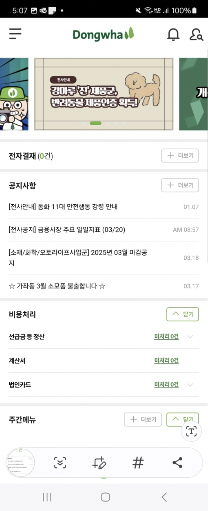
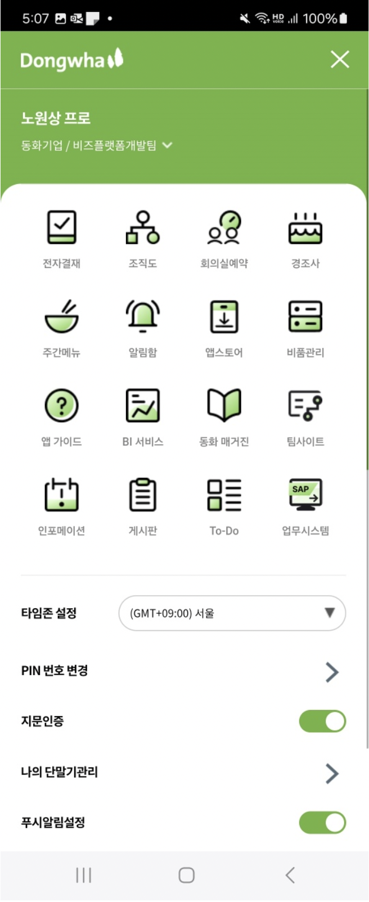
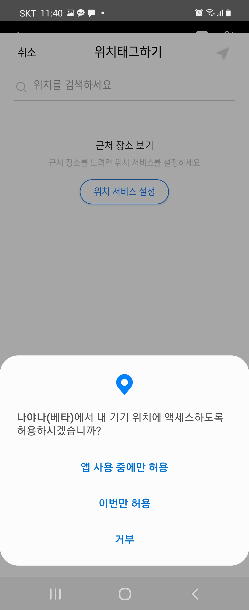
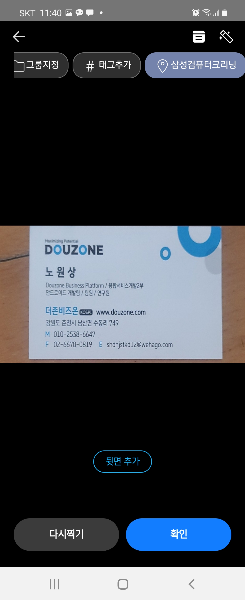
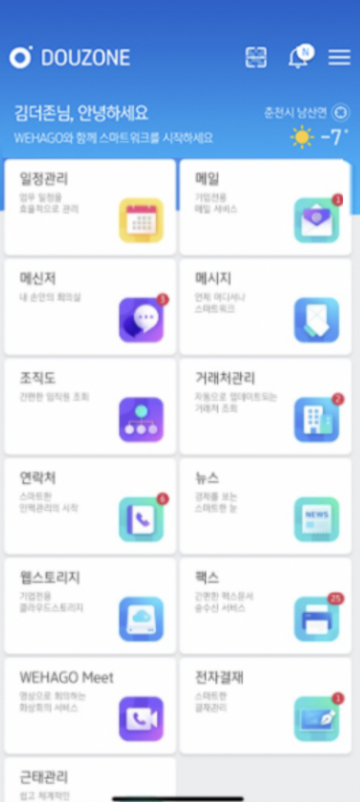

# 노원상 | 6년 차 모바일 풀스택 개발자

안녕하세요. **React Native, Android, iOS, Spring 기반 서버 개발 경험을 두루 갖춘 모바일 풀스택 개발자 노원상 대리**입니다.

저는 맡은 일에 끝까지 책임을 다하며, 현실에 안주하지 않고 **지속적인 성장과 개선**을 중요하게 여깁니다.  
더존비즈온 재직 중에는 회사 내 최초로 **크로스 플랫폼 도입을 성공하였고** React Native, 사내 테크톡을 통해 상태관리 아키텍처 등
기술 교육을 전사적으로 주도했습니다.
이후 동화기업에 재직하여 \*\*10개 이상의 앱을 단독 유지보수 및 운영하면서 모바일 전반의 기술 의사결정과 커뮤니케이션을 주도하고 있습니다.

**앱 개발뿐만 아니라 서버, 인프라, 배포, 인증, 보안까지 아우르는 폭넓은 실무 경험**을 바탕으로  
저는 일반적인 모바일 개발자보다 더 깊고 넓은 시야로 기술을 바라보며 일할 수 있다고 자부합니다.

<br>

## 경력 요약

### 🔹 동화기업(주) | 2022.07.06 ~ 재직중

[동화기업 회사정보 확인](https://www.dongwha.com/main/main.asp)

- **하이브리드 앱 5종 단독 유지보수 및 기능 개선**
  - GreenNet, D-RMS, D-Sales, D-Partners, IT-Service<br>
- **하이브리드 웹앱 3종 단독 유지보수**
  - D-Logis, Smart-Factory, D-RMS VN
- **신규 앱 개발**
  - VRGDW Store (베트남 고객용 주문관리 앱)
  - VRGDW D-Sales (베트남 자재 영업관리 앱)<br>
- **10개 이상의 Android/iOS 하이브리드 앱 단독 운영 및 스토어 배포**<br>
- **Spring + MySQL 기반 API 및 AWS 서버/인프라 운영**<br>
- **JWT, OAuth 2.0 기반 보안 인증 설계 및 적용**<br>
- **Web <-> Native Bridge & Native Module 설계 및 적용**<br>

### 🔹 (주) 더존비즈온 | 2019.07.15 ~ 2022.01.13

[(주)더존비즈온 회사정보 확인](https://www.jobplanet.co.kr/companies/81407/landing/%EB%8D%94%EC%A1%B4%EB%B9%84%EC%A6%88%EC%98%A8)

- **React Native 기반 신규 앱 개발**
  - Nahago (임금명세서, 출퇴근관리, 연말정산 기능)
  - NAYANA → 우리도 (강원도청 강원도민 대상)
  - WehagoOne (정부 과제 블록체인 간편계약)
  - WehagoSign (전자서명 인증 서비스)<br>
- **Android 앱 유지보수 및 기능 개선**
  - Wehago (B2B 협업 플랫폼)<br>
- **보안 기술 경험**
  - Sign-Then-Encrypt (RSA + AES + Signature)<br>
- **회사 내 최초 React Native 프로젝트 도입 및 아키텍처 설계 주도**<br>
- **정부 과제 프로젝트 성공경험 -> 정부 지원금 지급 및 성과 인정**<br>
- **JIRA, GitLab, Wiki 기반의 협업 환경 운영**<br>
- **Redux 상태관리 사내 전체 교육 진행 (+테크톡)**<br>

### 🔹 인턴 활동

- **(주) 제튼** (2019.02 ~ 2019.06)  
  [(주) 제튼 회사정보](<https://www.saramin.co.kr/zf_user/company-info/view/csn/VUVwS0RuV0hsTDJGUnBmWG5WaVkxdz09/company_nm/(%EC%A3%BC)%EC%A0%9C%ED%8A%BC>)
- **(주) 클루소프트** (2018.06 ~ 2018.08)  
  [(주) 클루소프트 회사정보](<https://www.saramin.co.kr/zf_user/company-info/view/csn/bDd0Rmx6UWM3d0VjTENDYlhtLzIvZz09/company_nm/(%EC%A3%BC)%ED%81%B4%EB%A3%A8%EC%86%8C%ED%94%84%ED%8A%B8>)

---

<br>

# 보유 언어


| 주요 사용 언어 / 기술 | 상세 내용                                                                                                                                                              |
| --------------------- | ---------------------------------------------------------------------------------------------------------------------------------------------------------------------- |
| **Java**              | - Android 네이티브 기능 & 모듈 개발<br>- WebView Bridge 구현<br>- Spring 기반 API 개발<br>- JWT, OAuth 2.0 인증 처리<br>- 모바일 백엔드 연동 포함한 풀사이클 개발 경험 |
| **JavaScript**        | - Morpheus, JitsiMeet 기반 모바일 하이브리드 UI 개발 및 기능 개발<br>- JavaScript Bridge 직접 구현                                                                     |
| **TypeScript**        | - React Native 기반 앱 개발<br>- Redux, React Query, RxJS 상태 관리 연계<br>- 안정적인 앱 구조 설계 및 구현 <br>- 비동기 통신 로직 설계                                |
| **Objective-C**       | - iOS 네이티브 기능 & 모듈 개발<br>- WKWebView Bridge 구현<br>- iOS 배포 및 정책 대응                                                                                  |
| **HTML & CSS**        | - 하이브리드 앱 내 웹 콘텐츠 마크업 및 스타일링<br>- 반응형 UI 적용<br>- 다수의 html 직접 구현                                                                         |
| **Kotlin**            | - Kotlin 기반 명함 촬영 모듈 고도화                                                                                                                                    |

---

<br><br>

# 협업 도구 및 운영 도구 (관리)

- Company Manament

```sh
- GitHub, GitLab, SourceTree, CodeCommit 등 다양한 협업 플랫폼 활용
- JIRA, Confluence(Wiki)를 활용한 일정 및 문서 관리
- EsLint, Prettier를 통한 코드 품질 및 일관성 유지
- App Store, Google Play Console을 통한 모바일 앱 스토어 배포 경험
- AWS (EC2, S3, RDS), Whatap 등을 활용한 인프라 운영 및 모니터링 경험
- 다양한 프로젝트에서 아키텍처 설계 및 기술 도입 주도
   → 회사 내 최초 React Native 하이브리드 프로젝트 도입 및 팀 내 기술 전파
```

- People Management

```sh
  교육: 회사 테크톡발표 , React-Native 교육 , redux 아키텍쳐 교육, Native kotlin 교육 제공
```

<div>
<a href="https://github.com/nowonsang/portfolio/blob/main/images/education/education1_file.pdf">

</a>
<a href="https://github.com/nowonsang/portfolio/blob/main/images/education/education2_file.pdf">

</a>
<a href="https://github.com/nowonsang/portfolio/blob/main/images/education/education3_file.pdf">

</a>
</div>

## <br>

# hybrid 프로젝트

## 하이브리드 앱 (직원관리, 원재료 관리, 자재 영업관리, 대리점 영업관리) 유지보수/고도화

**앱명**: GreenNet, D-RMS, D-Sales, D-Partners, IT-Service (총 5종)  
**회사**: 동화기업㈜  
**기간**: 2022.07.06 ~ 현재  
**운영 인원**: 1인 단독 운영  
**담당 역할**: Android/iOS 하이브리드 앱 유지보수 및 서버·인프라 운영<br>
**핵심 성과**: 5개 앱 무중단 단독 유지보수 (Android/ IOS)

### 🔍 프로젝트 소개

- GreenNet 모바일 : 결재, 직원 관리, 조직 문화, 사내 전반에서 발생하는 다양한 행위와 사내 업무지원 모바일 앱
- D-RMS : 사내 원재료의 입고/출고 관리 모바일 앱
- D-Sales : 영업사에 필요한 보드 & 건장재 자재 주문, 출고, 시공, A/S, 배송 시스템 모바일앱
- D-Partners : 파트너사 보드 & 건장재 자재 주문, 출고, 시공, A/S, 배송 시스템 모바일앱
- it-Servies : 사내 it 서비스 시스템상에 이슈 & 개선 요청 관리 모바일 앱

### ⚙️ 기술 스택 (Technical Lead)

```sh
Android(Java, RxJava, WebView)
iOS(Objective-C, WKWebView)
Hybrid(Morpheus,JavaScript, jQuery, CSS)
Backend(Spring, RESTful API)
DB(MySQL)
Architecture(MVC, MVVM)
Security(Proguard, OAuth 2.0, JWT)
Push & Dependency(Firebase, APNs)
Debugging(Chrome DevTools, chrome Inspector, Safari Web Inspector, Remote Log)
CI/CD(CodeCommit, CodeDeploy,SourceTree)
Certificate Management(Signing, Provisioning, Key 관리)
Monitoring(Whatap, CrashReport, Google Analytics)
AI Utilization(GPT-4 , Grok3)
```

### 🚀 주요 성과 (Key Achievements)

```sh
모바일 통합 로그인 체계 (AD -> M365 oAuth 2.0) 구축
전자결재 푸시 뱃지 동기화 ( IOS / Android )
스마트렌즈 & 재고조회 등 신규 서비스 (10종 이상 개발)
이미지 로딩 성능 개선
약 100건 이상 기능 개선
```

<br>
<div>






</div>

<br>

## 하이브리드 웹앱 (생산관리,운송사관리,운송장,베트남 원재료관리) 유지보수/고도화

**앱명**: D-Logis , Smart-Factory , D-RMS VN (3종)
**회사**: 동화기업㈜  
**기간**: 2022.07.06 ~ 현재  
**운영 인원**: 1인 단독 운영  
**담당 역할**: Android / iOS 하이브리드 웹앱 단독 운영, webView 브릿지 유지보수<br>
**핵심 성과**: 3개 앱 무중단 단독 유지보수 (Android/ IOS)

### 🔍 프로젝트 소개

- D-Logis : 사내 배송기사 , 운송장 관리 모바일 웹앱
- Smart-Factory: 공장 현황과 제품 오더 스케줄을 데이터와 연계하며 관리하는 모바일 앱
- D-RMS VN : 베트남 지역의 원재료를 효율적으로 관리하고 업무를 처리할 수 있도록 돕는 모바일 앱

### ⚙️ 기술 스택 (Technical Lead)

```sh
Android(Java, WebView, URL Scheme, File Download, Custom Popup)
iOS(Objective-C, WKWebView, Safari Inspector, Provisioning 관리)
Hybrid(Morpheus, JavaScript, jQuery, CSS)
NativeModule(Android/iOS JS Bridge 구현)
WebView Control(Window, File Download, Console Redirect)
Debugging(Chrome DevTools, chrome Inspector, Safari Web Inspector, Remote Log)
Security(Proguard, KeyStore/Keychain)
Dependency Management(Firebase, APNs)
CI/CD(CodeCommit,CodeDeploy, SourceTree)
Certificate Management(Signing, Provisioning, Key 관리)
Monitoring(Whatap, CrashReport, Google Analytics)
AI Utilization(GPT-4, Cursor)
```

### 🚀 주요 성과 (Key Achievements)

```sh
WebView 커스터마이징을 통한 사용자 경험 개선 (URL 스킴 감지, 팝업 처리, 파일 다운로드 등 WebView 내부 기능을 커스터마이징)
JS ↔ Native 연동 구조 직접 구현 (브릿지 모듈을 직접 설계 및 개발 )
보안 저장소를 활용한 사용자 민감 정보 보호 (Android Keystore, iOS Keychain)
서브앱 로그인 연동 기능 신규 구현 (URL Scheme , AD -> OAuth)
약 15건 이상의 기능 개선
```

<br>

<div>
  
  
  
  
  
  
</div>

## VRGDW Store (베트남 고객용 주문관리 모바일 앱)

**앱명**: VRGDW Store<br>
**회사**: 동화기업㈜<br>
**기간**: 2023.11.20 ~ 2024.01.25 (약 2개월)<br>
**참여 인원**: 1인 단독 개발<br>
**담당 역할**: WebView 기반 앱 전면 개발부터 배포까지 단독 수행<br>
**핵심 성과**: JS-Native 연동 구조를 안정적으로 구축하여 앱-웹 간 통신 효율성 확보
안정적인 서비스 오픈과 ,서비스 초기 안정성 확보 및 사용자 피드백 대응 완료<br>

### 🔍 프로젝트 소개

- 베트남 고객이 모바일로 자재를 주문, 주문 현황과 보고서를 확인할 수 있는 비즈니스 전용 모바일 앱

### ⚙️ 기술 스택 (Technical Lead)

```sh
Android(Java, WebView, URL Scheme, File Download, Custom Popup)
iOS(Objective-C, WKWebView, Safari Inspector, Provisioning 관리)
Hybrid(Morpheus, JavaScript, jQuery, CSS)
NativeModule(Android/iOS JS Bridge 구현)
WebView Control(Window, File Download, Console Redirect)
Debugging(Chrome DevTools, chrome Inspector, Safari Web Inspector, Remote Log)
Security(Proguard, KeyStore/Keychain)
Dependency Management(Firebase, APNs)
CI/CD(CodeCommit,CodeDeploy, SourceTree)
Certificate Management(Signing, Provisioning, Key 관리)
Monitoring(Whatap, CrashReport, Google Analytics)
AI Utilization(GPT-4, Cursor)
```

### 🚀 주요 성과 (Key Achievements)

```sh
WebView 기반 글로벌 하이브리드 앱 단독 개발 및 배포 (설계 및 개발, 테스트, 스토어 배포까지 전 과정을 1인 단독 수행)
WebView 커스터마이징을 통한 사용자 경험 개선 (URL 스킴 감지, 팝업 처리, 파일 다운로드 등등)
JS-Native Bridge 및 커스텀 Native 모듈 설계/구현 (다양한 하이브리드 연동 기능을 커스터마이징하여 완성)
보안 저장소를 활용한 사용자 민감 정보 보호 (Android Keystore, iOS Keychain)
Mobile Push 신규 연동 (Android , ios)
GooglePlay ,AppStore 배포
```

<br>

<div>
  
  
  
</div>

<br>

## VRGDW D-Sales (베트남 자재 영업관리 모바일 앱)

**앱명**: VRGDW D-Sales<br>
**회사**: 동화기업㈜<br>
**기간**: 2022.09.20 ~ 2023.12.31 (약 3개월)<br>
**참여 인원**: 1인 단독 개발<br>
**담당 역할**: WebView 기반 앱 전면 개발부터 배포까지 단독 수행<br>
**핵심 성과**: JS-Native 연동 구조를 안정적으로 구축하여 앱-웹 간 통신 효율성 확보
웹앱 기반 하이브리드 앱의 안정적인 서비스 오픈에 기여

### 🔍 프로젝트 소개

- 사내 베트남 지사에서의 영업, 물류 업무 프로세스를 디지털 모바일앱으로 전환한 영업 지원용 모바일 앱

### ⚙️ 기술 스택 (Technical Lead)

```sh
Android(Java, WebView, URL Scheme, File Download, Custom Popup)
iOS(Objective-C, WKWebView, Safari Inspector, Provisioning 관리)
Hybrid(Morpheus, JavaScript, jQuery, CSS)
NativeModule(Android/iOS JS Bridge 구현)
WebView Control(Window, File Download, Console Redirect)
Debugging(Chrome DevTools, chrome Inspector, Safari Web Inspector, Remote Log)
Security(Proguard, KeyStore/Keychain)
Dependency Management(Firebase, APNs)
CI/CD(CodeCommit, CodeDeploy,SourceTree)
Certificate Management(Signing, Provisioning, Key 관리)
Monitoring(Whatap, CrashReport, Google Analytics)
AI Utilization(GPT-4, Cursor)
```

### 🚀 주요 성과 (Key Achievements)

```sh
글로벌 대상 WebView 하이브리드 앱을 설계부터 배포까지 단독으로 개발 (기획, 구현, 테스트, 스토어 등록 전 과정 주도)
WebView 고도화로 사용자 경험(UX) 향상 실현 (URL 스킴 처리, 커스텀 팝업, 파일 다운로드 기능 최적화)
JS ↔ Native 연동 구조 커스터마이징 (브릿지 설계 및 자체 Native 모듈 개발로 웹-앱 간 통신 안정화)
플랫폼별 보안 저장소 적용으로 민감 정보 보호 강화 (Android Keystore, iOS Keychain 연동)
모바일 푸시 알림 기능 신규 도입 및 플랫폼별 적용 완료 (Android / iOS)
Google Play 및 Apple App Store 내 앱 런칭 완료 (국내/해외 배포 경험 보유)
```

<br>

<div>
  
  
  
  
</div>

<br><br>

## IOS,Android 앱 형상관리 (Store,Enterprise)

**앱명**: Android , IOS 모바일 전체 앱 <br>
**회사**: 동화기업㈜<br>
**기간**: 2022.07.06 ~ 현재 진행중<br>
**운영 인원**: 1인 단독 운영<br>
**담당 역할**: Public Store 및 기업용(Enterprise) Android , IOS 앱 전체 운영/배포 관리<br>
**핵심 성과**: 동화 모바일 앱 약 10종 이상을 단 한 차례의 중단 없이 안정적으로 관리
외주 앱 포함 전체 모바일 운영의 단독 총괄 관리 경험 보유

### ⚙️ 기술 스택 (Technical Lead)

```sh
Deployment: Google Play Console, Apple App Store, Apple Enterprise
Monitoring: Whatap, CrashReport, Google Analytics
App Authentication and Security: Apple Provisioning, Developer Certificate
Devices: UDID 등록, 테스트 기기 관리
Version Control: Semantic Versioning
```

### 🚀 주요 성과 (Key Achievements)

```sh
Android SDK 업그레이드 (SDK 29 → SDK 35)
iOS 버전 대응 (iOS 13.2 → 16.2) 및 보안 정책 대응
Google / Apple 보안 정책 및 배포 가이드라인 지속 대응
FCM 메시징 v1 버전 업그레이드
Google Play Protect 미확인 앱 경고 대응
```

<div>
  
  
  
</div>

<br><br>

## 모바일 앱 서버 & 인프라 관리 (AWS, Spring)

**앱명**: Android , IOS 모바일 전체 앱 <br>
**회사**: 동화기업㈜<br>
**기간**: 2022.07.06 ~ 현재 진행중<br>
**운영 인원**: 1인 단독 운영<br>
**담당 역할**: 모바일 앱 운영에 필요한 서버 관리를 단독 수행<br>
**핵심 성과**: AWS 기반 핵심 인프라 구성요소(Aurora, Redis) 업그레이드 주도 및 무중단 이관 성공
서버 관리를 단독 수행하며 백엔드 운영의 신뢰성 및 확장성 확보

### ⚙️ 기술 스택 (Technical Lead)

```sh
AWS (EC2, RDS (Aurora MySQL 8.0), ElastiCache (Redis), Route 53, CloudFront, WAF, Network ACL)
Application Server (Tomcat)
Build Tool (Maven, CodeDeploy, CodeCommit)
Framework (Spring, MyBatis, Stored Procedure)
Database (MySQL)
Security (JWT, OAuth)
OS: (Linux)
Monitoring: (Whatap, AWS CloudWatch)
기타: (Shell Script, crontab)
```

### 🚀 주요 성과 (Key Achievements)

```sh
모바일 앱 백엔드 서버(Spring 기반) 개발 및 유지보수
정기적인 서버 리소스 모니터링 및 튜닝 (CPU, Heap Memory, 디스크 용량 등)
AWS Aurora MySQL 업그레이드: Aurora MySQL (2.11.2 / 5.7) → Aurora MySQL (3.x / 8.0)
트래픽 제어 및 보안 설정 관리: AWS WAF, ACL 정책 구성 및 최적화
앱 연계 모바일 API 유지보수 및 신규 기능 대응
```

<div>
  
  
</div>

<br><br><br>

# React-Native 프로젝트

## 나하고 (임금명세서 , 출퇴근관리 , 연말정산 직원관리 모바일 앱)

**앱명**: NAHAGO <br>
**연계/소속회사**: (주)더존비즈온 <br>
**기간**: 2021.11 ~ 2022.01 (약 2개월) <br>
**참여 인원**: 6명 <br>
**담당 역할**: React Native 기반 하이브리드 앱의 다양한 인증 및 계정관리, 보안 모듈 등 전반적인 프론트엔드 개발을 전담<br>
**핵심 성과**: 단기간에 NAHAGO 신규 모바일 앱 안정적인 출시 및 운영 기여<br>

### 🔍 프로젝트 소개

- 중소기업·소상공인 등이 개정 근로기준법에서 요구하는 급여(임금)명세서 의무 교부에 쉽게 대응할 수 있도록 근무시간·
  급여관리 서비스를 제공하는 직장인용 앱 플랫폼

### ⚙️ 기술 스택 (Technical Lead)

```sh
React-Native(TypeScript,JavaScript,Java,kotlin)
State Management(Redux, Redux Toolkit, Redux-Observable, React Context, React Query)
React (Hooks 기반 함수형 컴포넌트 개발, Class Component → Function Component 전환 경험)
Architecture(Clean Architecture, MVVM , Redux Pattern)
Reactive Programming(ReactiveX, RxJS, RxJava)
Authentication & Authorization(OAuth 2.0, Self-authentication, Fingerprint, Face ID, Simple Auth)
API Integration(RESTful API, ajax, fetch, Axios, Retrofit)
Native Module(Android Java/Kotlin)
Security(Proguard, Rooting Guard, RSA, AES, App Signature)
Dependency Management(NPM, CocoaPods, Gradle, Shell Script)
```

### 🚀 주요 성과 (Key Achievements)

```sh
앱 스플래시 및 로그인/회원가입 화면 개발
계정 관리 기능 구현 (회사 추가/해지, 간편비밀번호, 아이디/비밀번호 찾기 등)
위하고앱 연동 기능 개발 및 통합 테스트 수행
본인확인 모듈 구축 (PIN, Face ID, FIDO, NICE 인증 연동)
보안 툴 연동 및 암호화 모듈 구성, 모바일 인증서 등록 기능 구현
```

<div>


</div>

## 나야나 -> 우리도(강원도청 플렛폼 앱)

**앱명**: 우리도 <br>
**연계/소속회사**: 강원도청 / (주)더존비즈온 <br>
**기간**: 2020.07 ~ 2021.03 (약 7개월) <br>
**참여 인원**: 4명 <br>
**담당 역할**: React Native 기반 하이브리드 앱의 프론트엔드 개발을 전담하며 주요 기능(UI/로직) 구현에 참여<br>
**핵심 성과**: 음성·화상 통화, 명함 촬영, 알림톡 등 핵심 모듈을 안정적으로 구현하여 강원도민을 위한 React-Native 하이브리드 모바일 우리도 앱 출시 및 품질 고도화에 기여
<br>

### 🔍 프로젝트 소개

- 개인의 신원·자격을 안전하게 증명할 수 있는 블록체인 기반의 분산신원증명(DID) 및 클라우드 기술이 적용된 앱으로써. 강원도민 사람들 위주로 비대면 신원인증 서비스를 통해 주민센터 등 기관 방문 없이 휴대폰으로 각종 보조금을 신청하거나 지급받을 수 있는 앱입니다

### ⚙️ 기술 스택 (Technical Lead)

```sh
React Native (TypeScript, JavaScript, Java, Kotlin)
State Management (Redux, Redux Toolkit, redux-observable, Middleware)
React (Class Component)
Real-Time Communication (Jitsi-Meet 커스터마이징, WebRTC 기반)
Architecture (Clean Architecture, Redux Pattern)
API Integration (RESTful API, Ajax, Fetch, Retrofit)
Local Storage & Caching (SQLite, TypeORM)
Security (Proguard, Rooting Guard, RSA, AES)
Dependency Management (Yarn, CocoaPods, Gradle, Shell Script, Firebase)
```

### 🚀 주요 성과 (Key Achievements)

```sh
로그인/회원가입 및 사용자 프로필 화면 개발
강원마트 기능 구현 및 쇼핑 UI 구성
음성/화상 통화 기능 개발 (Jitsi-Meet 기반 WebRTC)
명함 모듈 및 카메라 연동 기능 개발
알림톡 및 노티카운트 기능 구현
```

<div>






</div>

## 위하고원(블록체인 간편계약 모바일 앱)

**앱명**: WehagoOne <br>
**연계/소속회사**: 정부과제 -> (아이콘루프 / 더존비즈온)<br>
**기간**: 2020.07 ~ 2021.03 (약 7개월) <br>
**참여 인원**: 4명 <br>
**담당 역할**: React Native 기반 하이브리드 앱의 프론트엔드 전담, 로그인/회원가입 및 음성·화상 기능, 계약 채팅방 알림톡 프로세스 개발<br>
**핵심 성과**: 블록체인 간편계약 앱 개발 및 정부과제 성공 판정 -> 정부 지원금 지급 및 성과 인정<br>

### 🔍 프로젝트 소개

```sh
 정부 프로젝트 과학기술정보통신부·한국인터넷진흥원(KISA)의 ‘2020 블록체인 민간주도 국민 프로젝트’ 선정 과제로 선보인 블록체인 기술 기반의 소상공인과 개인을 위한 간편계약(구두계약) 앱 플랫폼
```

### ⚙️ 기술 스택 (Technical Lead)

```sh
React Native (TypeScript, JavaScript, Java, Kotlin)
State Management (Redux, Redux Toolkit, redux-observable, Middleware)
React (Class Component)
Real-Time Communication (Jitsi-Meet 커스터마이징, WebRTC 기반)
Architecture (Clean Architecture, Redux Pattern)
API Integration (RESTful API, Ajax, Fetch, Retrofit)
Local Storage & Caching (SQLite, TypeORM)
Security (Proguard, Rooting Guard, RSA, AES)
Dependency Management (Yarn, CocoaPods, Gradle, Shell Script, Firebase)
```

### 🚀 주요 성과 (Key Achievements)

```sh
  로그인/회원가입 UI 및 상태 관리 구현
  계약 채팅방 생성 프로세스 로직 구현
  음성/화상 채팅, 녹화 기능(Jitsi-Meet + WebRTC) 연동
  녹화된 영상/음성 기반 채팅 및 알림톡 기능 개발
```

<div>


</div>

## 위하고 Sign (회사 전자서명 앱)

**앱명**: WehagoSign <br>
**연계/소속회사**: (주)더존비즈온<br>
**기간**: 2020.02 ~ 2020.04 (약 3개월) <br>
**참여 인원**: 1명 <br>
**담당 역할**: 사내 전자서명 앱 React Native 기반 하이브리드 앱의 프론트엔드 개발을 전담 <br>
**핵심 성과**: 회사 내 최초로 React-Native 프로젝트 도입성공 & React-Native + Redux 상태관리 사내 전체 교육 진행(+테크톡) <br>

### 🔍 프로젝트 소개

- 중소기업·소상공인 등이 비대면으로 플랫폼 자체내에 회사 서명 업무를 진행 및 관리를 할수있게 서비스를 제공하는 직장인용 앱 플랫폼입니다

### ⚙️ 기술 스택 (Technical Lead)

```sh
React Native (Expo, TypeScript, JavaScript, Java, Kotlin, iOS)
React (클래스 컴포넌트 기반 개발 – componentDidMount, componentDidUpdate 등 Lifecycle 메서드 활용)
State Management (Redux, redux-observable)
Reactive Programming (ReactiveX, RxJS)
Architecture (Clean Architecture, Redux Pattern)
Authentication & Authorization (OAuth 2.0)
API Integration (RESTful API, Ajax)
Security (Proguard, Rooting Guard, RSA, AES)
Dependency Management (Yarn, Python Script, Firebase)
```

### 🚀 주요 성과 (Key Achievements)

```sh
사내 전자서명 시스템을 모바일로 구현
Sign-Then-Encypt (RSA + AES + Signature) 을 이용한 보안 인증서 개발
앱 전체 UI , 인증 흐름, 전자서명 로직 구현 및 테스트
아키텍쳐 설계 (Redux-observable) 최초 도입
```

<div>


</div>

---

<br><br>

# Android 프로젝트

## 위하고 And 앱(B to B 협업) 유지보수/고도화

**앱명**: Wehago <br>
**연계/소속회사**: (주)더존비즈온<br>
**기간**: 2019.07 ~ 2022.01 (2년 7개월) <br>
**참여 인원**: 4명 <br>
**담당 역할**: : Android 프론트엔드 유지보수 및 기능 고도화 <br>
**핵심 성과**: 대규모 B2B 협업 플랫폼의 핵심 화면과 기능을 안정적으로 유지보수 <br>

### 🔍 프로젝트 소개

```sh
 기업의 다양한 업무환경에 필요한 온라인 비즈니스 플랫폼으로써 (원활한 소통, 효율적인 업무관리, 서비스연동, 신속한 업무처리, 안전한 데이터관 리등)의 서비스를 제공하는 모바일 앱입니다
```

### ⚙️ 기술 스택 (Technical Lead)

```sh
And (Kotlin, Java, RxJava)
Pattern (MVVM, MVC)
API (Retrofit, Gson, OkHttp)
Network (RESTful API)
Push (Firebase Cloud Messaging, Notification Channel)
Storage (SharedPreferences, SQLite)
Security (Proguard)
Dependency Management (Firebase, Gradle)
```

### 🚀 주요 성과 (Key Achievements)

```sh
연락처 내보내기/가져오기 기능 개발
연락처 단어별 검색 기능 및 UI 개선
거래처 요금제 분기별 서비스 로직 구현
거래처 휴지통 기능 신규 개발
영어/일본어 로컬라이징 적용
뉴스/조직도/공지사항/잠금설정 등 100건 이상의 Jira QA 이슈 처리
```

##### 메인/뉴스

<div>



</div>

##### 연락처

<div>


</div>

##### 거래처

<div>


</div>

##### 설정/기타

<div>


</div>

<br>

## 한글공부 한글천재(인턴)

**앱명**: 한글공부 한글천재 <br>
**연계/소속회사**: (주)클루소프트 <br>
**기간**: 2017.12.21-2018.02.14 <br>
**참여 인원**: 2명 <br>
**담당 역할**: 한글그리기 모션 개발 + 영상 플랫폼 실행 <br>
**핵심 성과**: 한국어교육 앱 플랫폼 Android 앱 출시 <br>

### 🔍 프로젝트 소개

- '한글공부 한글천재 앱'은 한국어교육,난독중극복 및 언어치료에 도움을 주는 한글교육앱 플랫폼

### ⚙️ 기술 스택 (Technical Lead)

```sh
And (Java, Android Studio)
Drawing (Canvas, Paint, Path, Bitmap)
Video Playback (VideoView, MediaPlayer)
Touch Event Handling (onTouchEvent)
Cache (SQLite)
Security (Proguard, Rooting Guard)
CI/CD (GitLab, Fastlane)
```

### 🚀 주요 성과 (Key Achievements)

```sh
  그리기 모션 인식
  메인 개발
  영상 재생 개발
```

**플랫폼 소개 영상 :** https://www.youtube.com/watch?v=OSsHPK1mCjo

<div>


</div>

## 한글공부 게임 (대학교 프로젝트)

**앱명**: HangleStudy <br>
**개발 기간**: 2017.12.21-2018.02.14 <br>
**참여 인원**: 1명 <br>

### 🔍 프로젝트 소개

- 인턴 당시 만들었던 한글교육 한글천재에 영감을 얻고 고도화해서 게임형식으로 만든 대학교 프로젝트 입니다

### ⚙️ 기술 스택 (Technical Lead)

```sh
And (Java, Android Studio)
Drawing (Canvas, Paint, Path, Bitmap)
Video Playback (VideoView, MediaPlayer)
Touch Event Handling (onTouchEvent)
Cache (SQLite)
Security (Proguard, Rooting Guard)
CI/CD (GitLab, Fastlane)
```

### 🚀 주요 성과 (Key Achievements)

```sh
  그리기 모션 인식
  메인 개발
  영상 재생 개발
  회원가입,로그인 기능 개발
  앱 1인 개발
```

<div>


</div>

<br><br>

# Unity C# 프로젝트

## AR/VR 소화기 분사 플랫폼(인턴)

**회사**: (주)제튼 <br>
**기간**: 2017.12.21-2018.02.14 <br>
**참여 인원**: 1명 <br>

### 🔍 프로젝트 소개

- AR/VR 증강/가상현실속 화재상황시 직접 소화기 분사를 진행해보면서 실제로 이와같은 상황이 발생했을때
  화재 대처능력을 기를수있게 도와주는 앱 플랫폼입니다

### ⚙️ 기술 스택 (Technical Lead)

```sh
  Unity(C#,vuforia,VR CardBoard)
```

### 🚀 주요 성과 (Key Achievements)

```sh
  소화기 분사 1인 개발
```

**실행 동영상 :** https://www.youtube.com/watch?v=5yDfrHHk-Uk

<div>


</div>

### VR 화재안전 플랫폼(인턴)

**회사**: (주)제튼 <br>
**기간**: 2019.02 ~ 2019.03 <br>
**참여 인원**: 3명 <br>

### 🔍 프로젝트 소개

- AR/VR 증강/가상현실속 화재상황시 대피요령을 학습함으로써 실제로 이와같은 상황이 발생했을때
  화재 대피능력을 기를수있게 도와주는 앱 플랫폼입니다

### ⚙️ 기술 스택 (Technical Lead)

```sh
  Unity(C#,VR CardBoard)
```

### 🚀 주요 성과 (Key Achievements)

```sh
  텍스트 타이핑 애니메이션 개발
  충돌처리 및 파티클 개발
  핸드폰 기울기에 따른 VR 캐릭터 움직임 개발
```

**실행 동영상 :** https://www.youtube.com/watch?v=AlTTtl3l7lA

<div>


</div>

### VR 화재 체험 플랫폼 (인턴)

**소속**: 한림대학교 <br>
**기간**: 2018.09 ~ 2018.12 <br>
**참여 인원**: 5명 <br>

### 🔍 프로젝트 소개

- 'VR 화재 체험 플랫폼은' (주)제튼 회사에서 배웠던 기술들을 활용하여 졸업 프로젝트로 가상세계에서의 화재상황을 발생시켜
  화재시 대피하는 요령을 VR을 통해 체험하는 플랫폼을 만들었습니다

### ⚙️ 기술 스택 (Technical Lead)

```sh
  Unity(C#,virtual reality,OVRPlyaerController)
```

### 🚀 주요 성과 (Key Achievements)

```sh
 캐릭터 움직임 제어 개발
 타겟 충돌처리 & 이벤트 처리 개발
 불 파티클 개발,음성개발
 캐릭터 응시점 개발
```

<div>


</div>
